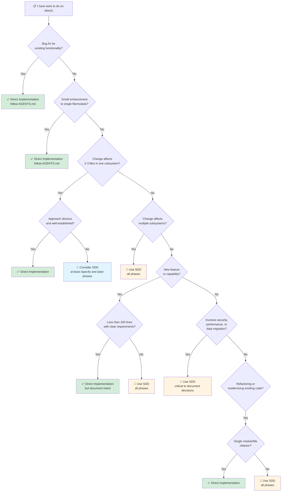

# SDD Adoption Guide

This guide helps teams and AI agents decide when to use Spec-Driven Development and how to integrate it into existing workflows.

## Decision Tree: Should I Use SDD?



**Rule of thumb**: If you're unsure whether to use SDD, start with `/specify`. Writing a 1-page spec takes 15 minutes and clarifies whether you need the full workflow.

## When to Use SDD vs Direct Implementation

### Use SDD When:

1. **Scope is unclear** - Requirements are vague or stakeholders have different interpretations
2. **Multiple approaches exist** - Technical design requires evaluation of trade-offs
3. **Cross-cutting changes** - Work spans multiple subsystems or layers (API → service → database)
4. **Risk is high** - Security-critical, performance-sensitive, or data-integrity concerns
5. **Collaboration is needed** - Multiple developers/teams will implement or review
6. **Documentation matters** - The "why" behind decisions needs to be preserved for future maintainers

### Use Direct Implementation When:

1. **Bug fix** - Correcting defects in existing functionality
2. **Obvious enhancement** - Adding a clearly-defined feature to a single module
3. **Pattern repetition** - Applying an established pattern to a new case
4. **Urgent hotfix** - Production issues requiring immediate fixes (document post-fix)
5. **Trivial changes** - Configuration updates, typo fixes, dependency bumps
6. **Local refactoring** - Code cleanup within a single file without behavior changes

### Gray Area: When to Use Partial SDD

For medium-complexity work, consider using only some phases:

- **Specify + Plan** (skip Tasks): For well-scoped features where experienced developers can self-organize implementation
- **Plan + Tasks** (skip Specify): When requirements are crystal clear but technical approach needs documentation
- **Specify only**: For exploratory work or RFCs where implementation is distant

## Gradual Adoption Strategy

### Phase 1: Pilot (Weeks 1-2)
- Choose one greenfield feature for full SDD workflow
- Assign both AI agent and human developer to collaborate
- Focus on learning the process, not perfection
- Capture lessons learned

**Success metric**: Complete one feature end-to-end with validated artifacts at each phase

### Phase 2: Expand (Weeks 3-6)
- Apply SDD to all new features >200 lines
- Use partial SDD (Specify + Plan) for medium features
- Continue direct implementation for bug fixes and small changes
- Build a library of examples in `.sdd/examples/`

**Success metric**: 50% of new feature work uses SDD; team can navigate `.sdd/` structure

### Phase 3: Integrate (Weeks 7-12)
- Integrate validation checklists into code review process
- Add SDD artifacts to CI/CD pipeline (linting, completeness checks)
- Train all team members on when to use SDD
- Establish "spec review" as distinct from "code review"

**Success metric**: SDD is default for complex work; direct implementation is default for simple work

### Phase 4: Optimize (Weeks 13+)
- Automate specification validation
- Build tooling to generate boilerplate from specs
- Refine skills and context based on project evolution
- Use specs as onboarding material for new team members

**Success metric**: SDD reduces rework, improves code review quality, and accelerates new feature delivery

## Integration with CI/CD

### Pre-Commit Checks
```bash
# Validate specification syntax and completeness
sdd-lint specs/my-feature.md

# Check that tasks reference valid plan sections
sdd-validate-tasks tasks/my-feature.md
```

### Pull Request Templates
Add SDD-specific PR template:
```markdown
## SDD Artifacts
- [ ] Specification: `specs/[feature-name].md`
- [ ] Plan: `plans/[feature-name].md`
- [ ] Tasks: `tasks/[feature-name].md`
- [ ] Validation: All phase checklists completed

## Task Implementation
This PR implements task #X from `tasks/[feature-name].md`

### Acceptance Criteria Met
- [ ] Criterion 1
- [ ] Criterion 2
- [ ] Tests pass
```

### Automated Validation
```yaml
# .github/workflows/sdd-validate.yml
name: Validate SDD Artifacts
on: [pull_request]
jobs:
  validate:
    runs-on: ubuntu-latest
    steps:
      - uses: actions/checkout@v3
      - name: Check spec completeness
        run: |
          # Ensure specs have all required sections
          python scripts/validate-spec.py
      - name: Verify plan references
        run: |
          # Check that plans reference valid specs
          python scripts/validate-plan.py
```

### Documentation Generation
Generate developer documentation from specifications:
```bash
# Create HTML docs from specs
sdd-docs-gen specs/ --output docs/features/

# Update architecture diagrams from plans
sdd-diagrams-gen plans/ --output docs/architecture/
```

## Team Workflow Integration

### For AI Agents
1. **Project context loading**: Read AGENTS.md first, then consult `.sdd/` for complex work
2. **Phase progression**: Complete each phase before proceeding; never skip validation
3. **Skill composition**: Load relevant skills from `.sdd/skills/` based on task requirements
4. **Context awareness**: Check `.sdd/context/subsystems/` for subsystem-specific constraints

### For Human Developers
1. **Feature kickoff**: Write specification collaboratively (or use AI to draft, then refine)
2. **Design review**: Review plan with team before implementation begins
3. **Task assignment**: Use task list to distribute work across team members
4. **Code review**: Review against task acceptance criteria, not just code quality

### For Tech Leads
1. **Requirement clarification**: Specifications become the tool for refining requirements
2. **Architectural oversight**: Plans are reviewable design documents
3. **Progress tracking**: Task lists show feature progress and dependencies
4. **Knowledge retention**: Specs/plans serve as living documentation for maintenance

## Common Pitfalls and Solutions

### Pitfall 1: "SDD is too much overhead"
**Solution**: Use the decision tree. SDD overhead is only justified for complex work. For simple changes, the overhead of direct implementation (debugging, rework, misalignment) is actually higher.

### Pitfall 2: "Specifications become outdated"
**Solution**: Treat specs as living documents in version control. When requirements change, update the spec first, then regenerate/update plan and tasks. The spec is always the source of truth.

### Pitfall 3: "We skip straight to coding"
**Solution**: For urgent work, implement first but document retrospectively. After the hotfix, write a spec and plan explaining what was built and why. This preserves knowledge.

### Pitfall 4: "AI agents can't validate their own work"
**Solution**: Use validation checklists as prompts. Have AI agents explicitly state which checklist items are met and provide evidence. Human review focuses on validating these claims.

### Pitfall 5: "Too many files in `.sdd/`"
**Solution**: Archive completed work. Move specs/plans/tasks for shipped features to `.sdd/archive/[version]/`. Keep only active and planned work in main directories.

### Pitfall 6: "SDD conflicts with Agile"
**Solution**: SDD is compatible with Agile. Specifications are lightweight (not waterfall docs). They evolve with each sprint. Tasks map to user stories. Use SDD for the "what" and "how," while Agile governs "when" and "who."

## Measuring Success

### Quantitative Metrics
- **Rework reduction**: % of features requiring major rewrites (target: <10%)
- **Code review efficiency**: Average PR review time (target: -30% for SDD work)
- **Defect rate**: Bugs per feature in first 30 days (target: -40%)
- **Onboarding time**: Time for new developers to contribute (target: -50%)

### Qualitative Indicators
- Developers can explain why code was written a certain way (by referencing specs/plans)
- Code reviews focus on correctness, not "what were you trying to do?"
- Architectural decisions are documented and discoverable
- AI agents produce higher-quality code on first attempt

## Rollback Strategy

If SDD adoption isn't working:

1. **Keep the artifacts**: Specifications and plans are valuable documentation even if the workflow is abandoned
2. **Salvage the structure**: Use `.sdd/skills/` and `.sdd/context/` as reference material for AGENTS.md
3. **Preserve examples**: Move successful examples to `docs/` for future reference
4. **Learn and iterate**: Document what didn't work and why

**SDD is a tool, not a religion.** Use it where it adds value; skip it where it doesn't.

## Getting Help

- **Methodology questions**: See [FAQ.md](FAQ.md)
- **Command usage**: See [`.sdd/commands/`](commands/)
- **Examples**: See [`.sdd/examples/`](examples/)
- **Role definitions**: See [`.sdd/roles/`](roles/)

---

**Remember**: The goal of SDD is to reduce ambiguity, prevent rework, and preserve knowledge. If it's not doing those things for your specific task, it's the wrong tool. Choose wisely.