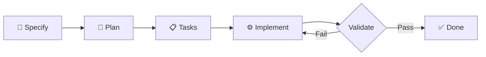

# Spec-Driven Development (SDD) for MAAS

This directory contains the infrastructure for Spec-Driven Development in MAAS—a structured methodology that transforms vague requirements into working code through four explicit phases with clear validation checkpoints.

## What is Spec-Driven Development?

Spec-Driven Development is an intent-driven approach where specifications become the source of truth. Instead of "vibe-coding" where you describe a goal and hope for the right code, SDD enforces a structured process:

1. **Specify** - Define the "what" and "why" (user needs, journeys, outcomes)
2. **Plan** - Design the "how" (architecture, stack, technical approach)
3. **Tasks** - Break down into atomic, reviewable work units
4. **Implement** - Execute tasks with validation at each step

Each phase produces living artifacts that evolve with the project. You don't move to the next phase until the current one is validated.



## When to Use SDD

Use SDD for:
- **Greenfield features**: New workflows, subsystems, or capabilities
- **Architectural changes**: Modifications affecting multiple subsystems
- **Cross-cutting concerns**: Security, performance, or infrastructure changes
- **Legacy modernization**: Rebuilding or refactoring existing systems

For simple bug fixes or isolated changes, direct implementation following [AGENTS.md](../AGENTS.md) is sufficient.

## Directory Structure

```
.sdd/
├── README.md                 # This file
├── commands/                 # Standardized command interface for each phase
├── roles/                    # Agent role definitions for each phase
├── skills/                   # Reusable techniques and patterns
│   ├── languages/           # Language-specific patterns (Python, Go, etc.)
│   ├── techniques/          # Cross-cutting techniques (testing, security, etc.)
│   ├── domains/             # MAAS domain knowledge
│   └── compositions/        # Pre-composed skill sets for common scenarios
├── context/                  # MAAS-specific architectural knowledge
│   ├── architecture/        # System-wide patterns and principles
│   └── subsystems/          # Subsystem-specific constraints and patterns
├── templates/                # Artifact templates for each phase
├── validation/               # Quality gates and checklists
├── examples/                 # End-to-end workflow demonstrations
├── specs/                    # Specifications (living documents)
├── plans/                    # Technical plans (living documents)
└── tasks/                    # Task breakdowns (living documents)
```

## The Four-Phase Workflow

### Phase 1: Specify
**Artifact**: Specification document in `specs/`  
**Role**: [Specifier](.sdd/roles/specifier-role.md)  
**Command**: See [/specify](.sdd/commands/specify.md)

Focus on user experience and business value. Answer:
- Who will use this?
- What problem does it solve?
- What does success look like?
- What are the user journeys?

**No technical decisions at this phase.** Keep it technology-agnostic.

**Validation**: [Specification Checklist](.sdd/validation/specification-checklist.md)

---

### Phase 2: Plan
**Artifact**: Technical plan in `plans/`  
**Role**: [Planner](.sdd/roles/planner-role.md)  
**Command**: See [/plan](.sdd/commands/plan.md)

Translate the specification into technical design. Answer:
- What architecture patterns apply?
- Which technologies and components are needed?
- How does this integrate with existing systems?
- What are the security and performance considerations?

Must reference [MAAS architectural patterns](.sdd/context/architecture/) and [subsystem constraints](.sdd/context/subsystems/).

**Validation**: [Plan Checklist](.sdd/validation/plan-checklist.md)

---

### Phase 3: Tasks
**Artifact**: Task list in `tasks/`  
**Role**: [Task Decomposer](.sdd/roles/task-decomposer-role.md)  
**Command**: See [/tasks](.sdd/commands/tasks.md)

Break specification and plan into atomic work units. Each task:
- Affects 1-3 files or a single module
- Has clear acceptance criteria
- Can be implemented and tested independently
- Specifies dependencies on other tasks

**Validation**: [Task Checklist](.sdd/validation/task-checklist.md)

---

### Phase 4: Implement
**Artifact**: Code in the repository  
**Role**: [Implementer](.sdd/roles/implementer-role.md)  
**Command**: See [/implement](.sdd/commands/implement.md)

Execute tasks following [AGENTS.md](../AGENTS.md) coding standards. For each task:
- Write tests first
- Implement minimal changes to achieve task objectives
- Validate against task acceptance criteria
- Follow relevant [skills](.sdd/skills/) and [subsystem context](.sdd/context/subsystems/)

**Validation**: [Implementation Checklist](.sdd/validation/implementation-checklist.md)

---

## Quick Start

### For AI Agents
1. Read the [AGENTS.md](../AGENTS.md) entry point
2. Determine if SDD is appropriate for your task
3. Start with `/specify` command and progress through phases
4. Consult relevant skills and context as needed

### For Human Developers
1. Review [examples](.sdd/examples/) to see complete workflows
2. Use SDD for complex features; direct implementation for simple changes
3. Specifications and plans serve as design review artifacts
4. Task lists guide implementation and code review

## Navigation

- **Get Started**: [Adoption Guide](.sdd/ADOPTION_GUIDE.md)
- **Learn by Example**: [Examples Directory](.sdd/examples/)
- **Find Skills**: [Skills Catalog](.sdd/skills/README.md)
- **Understand MAAS Architecture**: [Context Directory](.sdd/context/README.md)
- **Answer Questions**: [FAQ](.sdd/FAQ.md)

## Living Documents

All SDD artifacts are living documents stored in version control. When requirements change:

1. Update the specification
2. Regenerate or update the plan
3. Adjust task breakdowns
4. Continue implementation

The spec remains the source of truth. Code and docs should always reflect the current spec.

## Integration with MAAS Development

- **Conventional Commits**: All SDD work follows the [Conventional Commits](https://www.conventionalcommits.org/) specification
- **Code Review**: Task-based implementation enables focused, reviewable changes
- **CI/CD**: Validation checklists can be automated (future enhancement)
- **Documentation**: Specifications serve as design documentation

## Philosophy

> "The real innovation is the process. Intent is the source of truth, and specifications make intent executable."

SDD separates the stable "what" from the flexible "how," enabling iterative development without expensive rewrites. By making specifications executable through AI, we ensure that what gets built matches what was intended.

---

For questions or improvements to this methodology, see [ADOPTION_GUIDE.md](.sdd/ADOPTION_GUIDE.md) or consult the [FAQ](.sdd/FAQ.md).