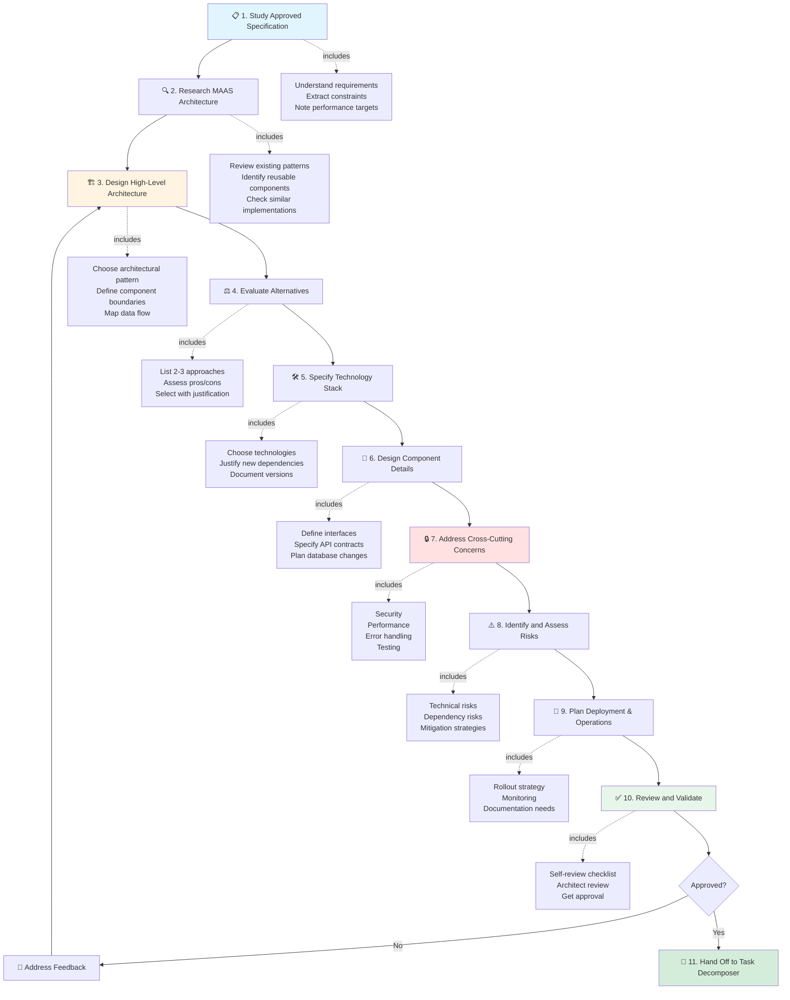
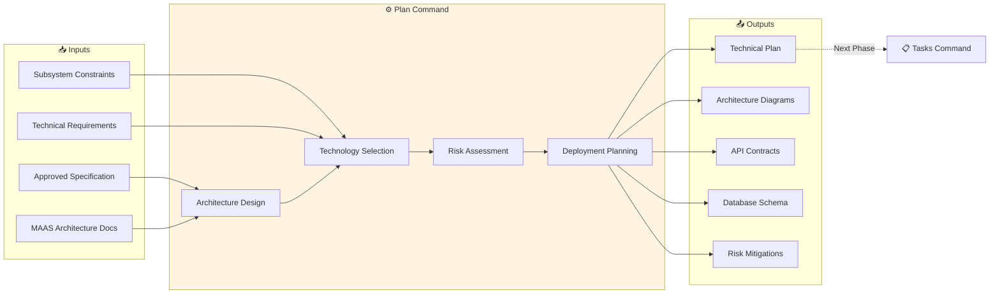

# SDD Command: Plan

## Purpose

The `plan` command creates a technical plan that translates a user-focused specification into a concrete technical design. This command guides the Planner role in documenting **how** the feature will be built, including architecture, technology choices, component design, and risk assessment.

## Invocation Pattern

**When to use:**
- Specification has been approved
- Technical approach needs to be defined
- Architecture decisions must be documented
- Implementation guidance is needed

**Who invokes:**
- Technical Lead
- Software Architect
- Senior Engineer
- Anyone responsible for technical design

**Command:**
```
I need to create a technical plan for an approved specification.

Specification: [Path to specification document]
Feature: [Brief description]

Please guide me through creating a technical plan using the SDD process.
```

## Inputs Required

### 1. Approved Specification
- **Location:** Path to `.sdd/specs/[feature]-specification.md`
- **Status:** Must be "Approved"
- **Contents:** Problem statement, user journeys, acceptance criteria, success criteria

**What to extract:**
- User requirements and constraints
- Performance expectations
- Integration points
- Success criteria to validate against

### 2. MAAS Architecture Knowledge
- Current MAAS architecture patterns
- Existing components and their responsibilities
- Technology stack (Python/Django, Twisted, React, PostgreSQL)
- Integration points and APIs
- Deployment model

### 3. Technical Constraints
- Backwards compatibility requirements
- Performance targets from specification
- Security requirements
- Operational constraints
- Resource limitations

## Outputs Produced

### Technical Plan Document
**File:** `.sdd/plans/[feature-name]-technical-plan.md`

**Template:** Use `.sdd/templates/TECHNICAL_PLAN_TEMPLATE.md`

**Required Sections:**

#### 1. Executive Summary
- Brief overview of technical approach
- Key architectural decisions
- Top 2-3 risks and mitigations

#### 2. Architectural Approach
- High-level architecture diagram
- Component overview
- Architectural pattern chosen
- Data flow for key scenarios
- Alternatives considered and why rejected

#### 3. Component Design
- List of components to build/modify
- Responsibilities of each component
- Interfaces between components
- Technology choice for each component with justification

#### 4. Integration Points
- External systems this connects with
- MAAS internal components affected
- API contracts
- Database schema changes

#### 5. Technology Stack
- Languages, frameworks, libraries
- Versions and compatibility
- New dependencies (with justification)
- Rationale for technology choices

#### 6. Security Considerations
- Authentication/authorization approach
- Data protection
- Threat model
- Security controls

#### 7. Performance Requirements
- Target metrics from specification
- Performance strategy
- Optimization techniques
- Scalability plan

#### 8. Error Handling & Resilience
- Failure modes and handling
- Resilience patterns
- Retry logic
- Graceful degradation

#### 9. Database Schema Changes
- New tables/columns
- Indexes
- Migrations
- Data migration strategy

#### 10. Testing Strategy
- Unit testing approach
- Integration testing plan
- End-to-end testing
- Performance testing

#### 11. Deployment Plan
- Rollout strategy
- Feature flags
- Monitoring and alerting
- Rollback plan

#### 12. Risks & Mitigations
- Technical risks identified
- Probability and impact
- Mitigation strategies
- Contingency plans

**Status:** Draft | Under Review | Approved

## Validation Checklist

Before considering plan complete, verify:

- [ ] **Architecture is clear:** Component responsibilities and interactions well-defined
- [ ] **Technology choices justified:** Every significant decision has rationale
- [ ] **MAAS patterns referenced:** Plan shows how it fits existing architecture
- [ ] **Alternatives documented:** At least 2-3 alternatives considered for major decisions
- [ ] **Risks identified:** Technical risks with probability, impact, mitigation
- [ ] **Integration points specified:** How this connects with existing systems
- [ ] **Performance addressed:** Strategy for meeting specification's performance targets
- [ ] **Security considered:** Authentication, authorization, data privacy covered
- [ ] **Testing strategy defined:** Unit, integration, e2e approaches specified
- [ ] **Deployment planned:** Rollout, monitoring, rollback documented
- [ ] **No specification changes:** Implements what was specified, not something different
- [ ] **Implementable:** Provides enough detail for task decomposition

Use `.sdd/validation/plan-checklist.md` for detailed validation.

## Process Flow



**Input/Output Flow:**



## Examples

### Example 1: API Extension

**Invocation:**
```
Create technical plan for approved specification.

Specification: .sdd/specs/hardware-filtering-specification.md
Feature: Hardware-based machine filtering in web UI

Guide me through planning.
```

**Key Planning Decisions:**

**Architectural Approach:**
Extend existing `/api/2.0/machines/` endpoint with query parameters for hardware filters. Use Django ORM filter() with database indexes for performance. React UI components for filter controls.

**Alternatives Considered:**
1. **Separate search service**: Rejected - adds operational complexity, overkill for this use case
2. **Client-side filtering**: Rejected - doesn't scale for 5,000+ machines
3. **Extend existing endpoint** (chosen): Leverages existing infrastructure, minimal changes

**Technology Stack:**
- Backend: Python/Django (existing) - no new dependencies
- Frontend: React + Redux Toolkit (existing) - no new dependencies
- Database: PostgreSQL with indexes (existing)

**Rationale:** Default to MAAS standard stack. No need for new technologies; existing stack can handle requirements.

**Performance Strategy:**
- Add database indexes on cpu_count, memory, storage_type
- Use select_related() to avoid N+1 queries
- Pagination (100 results per page)
- Target: <2 seconds for 5,000 machines

**Risk Assessment:**
- **Risk:** Database performance degrades with many filters
  - **Probability:** Medium
  - **Impact:** High
  - **Mitigation:** Add indexes, performance tests in CI, query optimization

### Example 2: New Background Service

**Invocation:**
```
Create technical plan for region health monitoring.

Specification: .sdd/specs/region-health-monitoring-specification.md

Please guide planning process.
```

**Key Planning Decisions:**

**Architectural Approach:**
Background service using Twisted LoopingCall to periodically check region health. Store results in PostgreSQL. Emit events for state changes.

**Component Design:**
```
RegionHealthMonitor (Twisted Service)
    ↓
Checks region /api/2.0/version/ endpoint
    ↓
Updates RegionHealth table
    ↓
Emits HealthChangeEvent (if status changed)
```

**Alternatives Considered:**
1. **Celery periodic task**: Adds Celery dependency, need message queue
2. **Cron job**: External dependency, harder to test
3. **Twisted LoopingCall** (chosen): Native to MAAS, no new dependencies, easy to test

**Technology Stack:**
- Backend: Python/Twisted (existing)
- HTTP Client: treq (existing, Twisted-native)
- Database: PostgreSQL (existing)
- No new dependencies

**Testing Strategy:**
- Unit tests: Mock treq HTTP calls
- Integration tests: Use test server for region endpoint
- Test circuit breaker behavior (3 failures → offline)

**Deployment:**
- Deploy as part of region controller service
- Starts automatically with region controller
- No separate service needed

## Common Pitfalls

### ❌ Over-Engineering
**Wrong:** "Build microservices architecture with Kubernetes, service mesh, event sourcing..."
**Right:** "Extend existing API endpoint using established Django patterns"

### ❌ Technology Resume Building
**Wrong:** "Let's rewrite in Rust for performance"
**Right:** "Python with optimization meets performance requirements"

### ❌ Unjustified Decisions
**Wrong:** "Use Redis for caching" (no explanation)
**Right:** "Use PostgreSQL query caching; Redis not needed because cache hit rate modeling shows minimal benefit vs operational overhead"

### ❌ Ignoring MAAS Patterns
**Wrong:** Creating custom authentication when MAAS has OAuth 1.0
**Right:** Reuse existing MAAS authentication mechanisms

### ❌ No Risk Analysis
**Wrong:** Assuming everything will work perfectly
**Right:** "Risk: API compatibility breaks. Mitigation: Version detection, adapter pattern, extensive testing"

### ❌ Vague Architecture
**Wrong:** "Add a service that handles requests"
**Right:** "QueryCoordinator service accepts search requests via POST /api/2.0/machines/search/, queries regional APIs in parallel using Twisted DeferredList, returns merged JSON"

### ❌ Changing Specification
**Wrong:** Adding features not in specification
**Right:** Implementing exactly what specification requires; flag scope changes for discussion

## Decision Documentation Pattern

For every major technical decision, document:

```markdown
**Decision:** [What was chosen]

**Alternatives Considered:**
1. Option A: [Pros/Cons]
2. Option B: [Pros/Cons]
3. Option C (chosen): [Pros/Cons]

**Evaluation Criteria:**
- [Criterion 1]
- [Criterion 2]
- [Criterion 3]

**Rationale:**
[Why this option is best given the criteria]

**Trade-offs:**
[What we're accepting with this choice]

**MAAS Context:**
[How this fits existing MAAS architecture]
```

## Resources

- **Template:** `.sdd/templates/TECHNICAL_PLAN_TEMPLATE.md`
- **Validation:** `.sdd/validation/plan-checklist.md`
- **Role Guide:** `.sdd/roles/planner-role.md`
- **Skills:**
  - `.sdd/skills/architecture-design.md`
  - `.sdd/skills/stack-selection.md`
  - `.sdd/skills/constraint-analysis.md`
- **Examples:** `.sdd/examples/new-feature-workflow.md`

## Next Steps

After technical plan is approved:

1. **Hand off to Task Decomposer** with complete technical plan and diagrams
2. **Task Decomposer creates task list** (use `tasks` command)
3. **Stay available** to answer questions during task decomposition
4. **Review task list** to ensure alignment with technical plan
5. **Provide clarification** to implementers during development if needed

## Review Criteria

**Architecture Review:**
- [ ] Consistent with MAAS patterns
- [ ] Appropriate level of complexity
- [ ] Scalable and maintainable
- [ ] Integration points well-defined

**Security Review:**
- [ ] Authentication/authorization addressed
- [ ] Data protection considered
- [ ] Threat model documented
- [ ] Security controls specified

**Performance Review:**
- [ ] Meets specification targets
- [ ] Optimization strategy sound
- [ ] Performance testing planned
- [ ] Scalability considered

**Operations Review:**
- [ ] Deployment plan feasible
- [ ] Monitoring adequate
- [ ] Rollback plan exists
- [ ] Documentation planned

## Summary

The `plan` command creates detailed technical plans that translate user-focused specifications into implementable designs. A good technical plan provides clear architectural guidance, justifies technology choices, identifies risks, and enables efficient task decomposition and implementation.

**Key Principles:**
- Default to MAAS standard stack
- Justify all significant decisions
- Reference existing MAAS patterns
- Identify and mitigate risks
- Provide enough detail for implementation
- Stay true to specification requirements