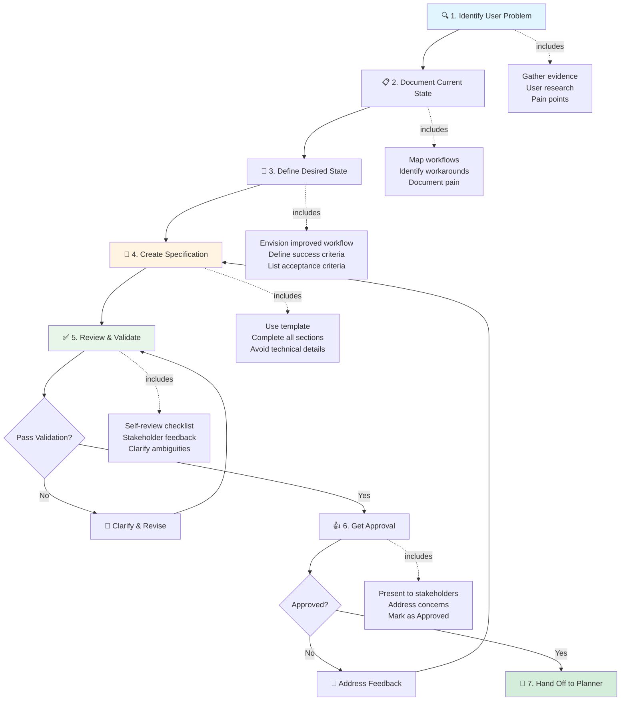
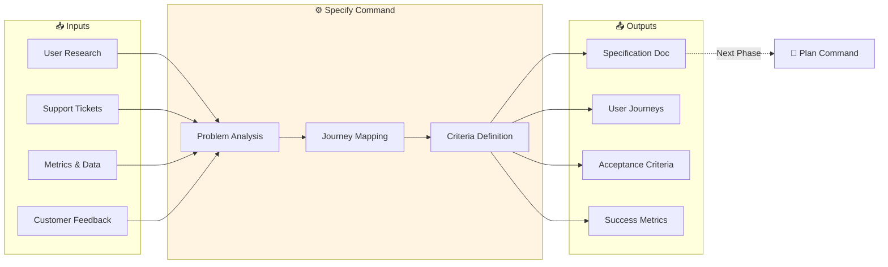

# SDD Command: Specify

## Purpose

The `specify` command initiates the Specification-Driven Development process by creating a user-focused specification document. This command guides the Specifier role in documenting **what** needs to be built and **why**, without prescribing technical implementation details.

## Invocation Pattern

**When to use:**
- New feature request received
- User problem identified
- Enhancement to existing functionality needed
- Integration requirement discovered

**Who invokes:**
- Product Manager
- User Researcher
- Technical Writer
- Anyone translating user needs into specifications

**Command:**
```
I need to specify a new feature for MAAS.

Feature: [Brief description]
Problem: [User problem to solve]
Users: [Who needs this]

Please guide me through creating a specification using the SDD process.
```

## Inputs Required

### 1. Problem Context
- **User Problem:** What pain point or gap exists today?
- **Impact:** How does this affect users? (time lost, errors made, opportunities missed)
- **Urgency:** Why does this need to be solved now?
- **Evidence:** User research, support tickets, metrics, customer feedback

**Example:**
```
Problem: MAAS operators managing 5+ regional controllers must manually log into each region to view machine inventory, making it impossible to quickly locate machines across the infrastructure.

Impact: 15-30 minutes wasted per incident when troubleshooting cross-region issues. Operators resort to maintaining manual spreadsheets, which become stale and unreliable.

Urgency: Blocking 3 enterprise sales opportunities where multi-region visibility is a hard requirement. Customer escalations increasing.

Evidence: 12 support tickets in last quarter, user interviews with 8 operators, feature request with 45 upvotes.
```

### 2. Target Users
- **Primary Users:** Who will directly use this feature?
- **Secondary Users:** Who benefits indirectly?
- **User Characteristics:** Skill level, environment, constraints, tools used

**Example:**
```
Primary Users:
- MAAS Operators: Manage 100-1000 machines across 2-10 regions
- Platform Engineers: Build automation on top of MAAS

Secondary Users:
- Application Owners: Check deployment status
- Security Auditors: Review compliance across regions

Characteristics:
- Comfortable with CLI and web UI
- Work in time-sensitive incident response
- Use Terraform, Ansible for automation
- May be on-call with limited access
```

### 3. User Journeys
- **Current Workflow (As-Is):** How do users accomplish this today?
- **Desired Workflow (To-Be):** How should users accomplish this with the feature?
- **Pain Points:** Where does current workflow break down?
- **Success Scenario:** What does success look like?

**Example:**
```
Current Workflow (As-Is):
1. Receive incident alert for unknown machine
2. Guess which region it might be in
3. Log into region 1 web UI
4. Search for machine (not found)
5. Log into region 2 web UI
6. Search for machine (not found)
7. Repeat for all regions until found
8. Total time: 15+ minutes

Desired Workflow (To-Be):
1. Receive incident alert
2. Open unified search in MAAS
3. Enter machine name
4. See results from all regions instantly
5. Click machine to view details
6. Total time: 30 seconds

Pain Points:
- Manual region-by-region search
- No memory of which region was checked
- Authentication to each region separately
- Context loss switching between regions
```

### 4. Success Criteria
- **User Success:** Observable behaviors showing users find value
- **Business Success:** Business metrics or goals achieved
- **Operational Success:** Operational improvements

**Example:**
```
User Success:
- Time-to-locate machines reduced by >80%
- Feature used 5+ times per day per operator
- Zero "can't find machine" escalations after 30 days

Business Success:
- Unblocks 3 enterprise sales ($450K ARR)
- Reduces incident resolution time by 20 minutes
- Increases multi-region adoption by 40% in 6 months

Operational Success:
- Cross-region queries return in <3 seconds
- No increase in regional controller load beyond 5%
- <1 hour per month maintenance overhead
```

### 5. Acceptance Criteria
- **Must Have (MVP):** Non-negotiable for feature to be useful
- **Should Have:** Important but can defer to follow-up
- **Could Have:** Nice-to-have for future

**Example:**
```
Must Have (MVP):
- Search machines across all regions from single interface
- Results display within 3 seconds for 1000 machines/region
- Results show which region each machine is in
- Filter by region, status, and tags
- Click machine to view detail page
- Works with existing authentication
- Gracefully handle unavailable regions

Should Have:
- Persist search results when navigating back
- Export results to CSV
- Save search filters as presets
- Real-time updates

Could Have:
- Advanced query syntax (boolean, wildcards)
- Search by hardware specs
- Bulk actions across regions
- API endpoint
```

### 6. Scope Boundaries
- **Out of Scope:** Explicitly not included
- **Deferred:** Valuable but postponed
- **Constraints:** Technical or business limitations

## Outputs Produced

### Specification Document
**File:** `.sdd/specs/[feature-name]-specification.md`

**Template:** Use `.sdd/templates/SPECIFICATION_TEMPLATE.md`

**Contents:**
1. **Problem Statement:** Clear articulation of user problem and impact
2. **Target Users:** Primary and secondary users with characteristics
3. **User Journeys:** Detailed as-is and to-be workflows
4. **Success Criteria:** User, business, and operational success measures
5. **Acceptance Criteria:** Must-have, should-have, could-have requirements
6. **Out of Scope:** Explicitly excluded items
7. **Assumptions and Dependencies:** What we're taking for granted
8. **Open Questions:** Unanswered items needing clarification

**Status:** Draft | Under Review | Approved

### Artifacts
- User research findings (interviews, surveys, data analysis)
- Journey maps or diagrams
- User personas (if applicable)
- Competitive analysis (if relevant)
- Mockups or sketches (optional, not detailed designs)

## Validation Checklist

Before considering specification complete, verify:

- [ ] **Problem is clear:** Any reader understands what's wrong and why it matters
- [ ] **Impact is quantified:** Specific metrics, time, or costs stated
- [ ] **Users are defined:** Specific user roles and characteristics documented
- [ ] **Journeys are concrete:** Step-by-step workflows with actions and outcomes
- [ ] **Success is measurable:** Observable criteria for determining success
- [ ] **Acceptance criteria are testable:** Each can be verified with yes/no answer
- [ ] **Scope is bounded:** Out-of-scope items explicitly listed
- [ ] **No technical prescription:** Doesn't dictate how to implement
- [ ] **Assumptions stated:** Dependencies and assumptions documented
- [ ] **Questions raised:** Uncertainties identified for planning phase

Use `.sdd/validation/specification-checklist.md` for detailed validation.

## Process Flow



**Input/Output Flow:**



## Examples

### Example 1: Simple Feature

**Invocation:**
```
I need to specify a feature for MAAS.

Feature: Hardware-based machine filtering in web UI
Problem: Operators cannot filter machines by CPU/RAM/storage in the UI
Users: MAAS operators managing large deployments (500+ machines)

Guide me through the specification process.
```

**Key Specification Elements:**

**Problem Statement:**
Operators managing large MAAS deployments (500+ machines) cannot filter machines by hardware specifications in the web UI. They must export the entire machine list to CSV and filter in Excel, wasting 5-10 minutes per query. This blocks rapid response to resource requests like "find 10 machines with 128GB+ RAM."

**User Journey (To-Be):**
1. Operator opens machine list in MAAS UI
2. Clicks "Add Filter" → selects "RAM" → enters ">=128GB"
3. Results filter instantly to show matching machines
4. Operator adds second filter: "Storage Type" = "NVMe"
5. Sees final filtered list, selects machines for allocation
Total time: 30 seconds

**Acceptance Criteria (Must Have):**
- Filter by CPU count (min/max)
- Filter by RAM size (min/max)
- Filter by storage type (HDD, SSD, NVMe)
- Filter by storage capacity (min/max)
- Filters are combinable (AND logic)
- Results update in <2 seconds for 5000 machines
- Filter state persists when navigating away and back

### Example 2: Integration Feature

**Invocation:**
```
Specify integration feature.

Feature: Webhook notifications for machine events
Problem: External systems (Slack, PagerDuty, custom tools) need real-time MAAS event notifications
Users: Operations teams integrating MAAS with monitoring/alerting

Please create the specification.
```

**Key Specification Elements:**

**Target Users:**
- DevOps Engineers: Integrate MAAS with incident response tools
- Platform Engineers: Trigger automation based on MAAS events
- Operations Teams: Monitor MAAS infrastructure health

**User Journey:**
1. Admin registers webhook URL via MAAS API
2. Admin selects event types (deployment failed, hardware fault, etc.)
3. Admin optionally filters by tags or resource pools
4. When event occurs, MAAS POSTs JSON payload to webhook URL
5. External system receives event and takes action (alert, ticket, remediation)

**Success Criteria:**
- Webhooks delivered within 5 seconds of event
- 99.9% delivery success rate
- Easy to register/manage webhooks via UI and API
- 10+ external integrations built by community in 6 months

### Example 3: Performance Improvement

**Invocation:**
```
Specify performance improvement.

Feature: Faster commissioning for known hardware
Problem: Commissioning takes 15-20 minutes even for previously-tested hardware models
Users: Operators provisioning machines frequently

Create specification.
```

**Problem Statement:**
Commissioning in MAAS takes 15-20 minutes per machine, even when the hardware model has been commissioned many times before. Operators provisioning 100+ machines per week waste hours waiting for redundant hardware testing. For known-good hardware, commissioning could be much faster.

**User Journey (Desired):**
1. Operator allocates machine with "known hardware" tag
2. MAAS detects hardware matches previously commissioned model
3. MAAS skips redundant tests, runs only essential checks
4. Commissioning completes in 2-3 minutes instead of 15-20
5. Operator proceeds with deployment quickly

**Success Criteria:**
- Commissioning time reduced by 75% for known hardware
- Zero increase in hardware failure rates
- Operators report significant time savings (survey)
- Feature used for 60%+ of commissioning operations

**Out of Scope:**
- Changes to commissioning scripts themselves
- New hardware testing capabilities
- Support for exotic/rare hardware
- Automatic hardware model detection (must be tagged)

## Common Pitfalls

### ❌ Specifying the Solution
**Wrong:** "Add a Redis cache to speed up machine queries"
**Right:** "Users need machine search results within 2 seconds for 5000-machine environments"

### ❌ Vague Requirements
**Wrong:** "Make the UI better"
**Right:** "Users should complete hardware filtering in under 30 seconds without consulting documentation"

### ❌ Missing the "Why"
**Wrong:** "Add cross-region search"
**Right:** "Operators waste 15+ minutes searching regions manually during incidents, delaying incident response"

### ❌ No User Research
**Wrong:** "I think users would like..."
**Right:** "In interviews with 8 operators, all reported..."

### ❌ Hidden Assumptions
**Wrong:** "Users can search across regions"
**Right:** "Users can search across regions (assumes regions are configured and network-accessible)"

## Resources

- **Template:** `.sdd/templates/SPECIFICATION_TEMPLATE.md`
- **Validation:** `.sdd/validation/specification-checklist.md`
- **Role Guide:** `.sdd/roles/specifier-role.md`
- **Skills:**
  - `.sdd/skills/user-journey-mapping.md`
  - `.sdd/skills/requirements-elicitation.md`
- **Examples:** `.sdd/examples/new-feature-workflow.md`

## Next Steps

After specification is approved:

1. **Hand off to Planner** with complete specification and supporting artifacts
2. **Planner creates technical plan** (use `plan` command)
3. **Stay available** to answer questions during planning
4. **Validate technical approach** aligns with user goals (without dictating implementation)

## Summary

The `specify` command creates user-focused specifications that define **what** to build and **why**, without prescribing **how**. A good specification enables creative technical solutions by providing clarity on problems and success criteria while leaving implementation decisions to the planning and implementation phases.

**Key Principle:** Understand the user problem deeply, document it clearly, and let the technical team design the best solution.