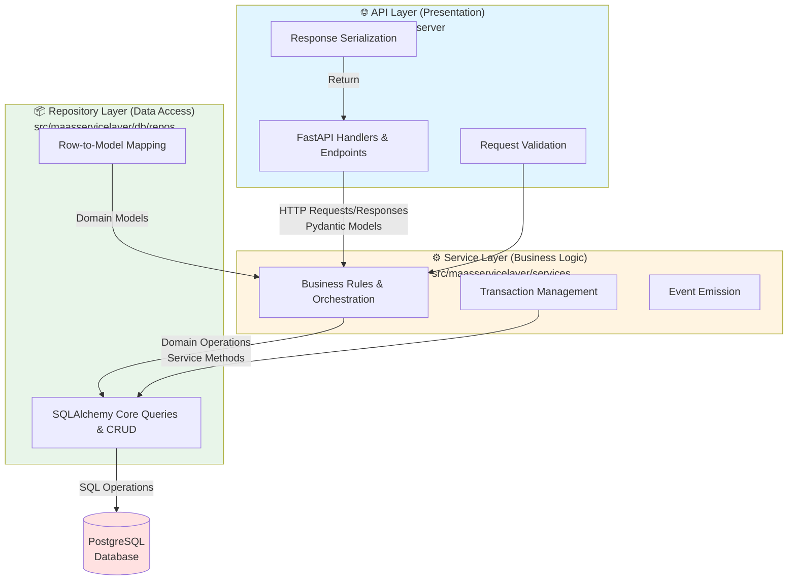

# Three-Tier Architecture

## Overview

MAAS implements a three-tier architecture pattern for its modern v3 API, providing clear separation of concerns between presentation, business logic, and data access layers. This architecture ensures maintainability, testability, and scalability of the application.

## Architecture Layers



## Layer Responsibilities

### 1. API Layer (Presentation)

**Location**: `src/maasapiserver`

**Purpose**: Handle HTTP communication, request validation, and response serialization.

**Responsibilities**:
- Define API endpoints and routes
- Validate incoming requests using Pydantic models
- Serialize responses using Pydantic models
- Handle authentication and authorization checks
- Map HTTP status codes and errors
- Generate OpenAPI documentation

**Key Characteristics**:
- No business logic
- No direct database access
- Thin layer that delegates to services
- Stateless request handlers

**Example**:
```python
@handler
class MachineHandler(Handler):
    async def get(self, machine_id: int) -> MachineResponse:
        machine = await self.service.get_by_id(machine_id)
        return MachineResponse.from_model(machine)
```

### 2. Service Layer (Business Logic)

**Location**: `src/maasservicelayer/services`

**Purpose**: Implement business rules, orchestrate operations, and coordinate between repositories.

**Responsibilities**:
- Enforce business rules and validation
- Coordinate multiple repository operations
- Implement transaction boundaries
- Handle cross-cutting concerns (events, caching)
- Transform between repository models and domain models
- Orchestrate complex workflows

**Key Characteristics**:
- Contains all business logic
- No HTTP or presentation concerns
- No direct SQL queries
- Uses repositories for data access
- Testable with mocked repositories

**Example**:
```python
class MachineService(BaseService):
    async def create(self, resource: MachineCreateBuilder) -> Machine:
        # Business logic here
        if not await self._validate_resources(resource):
            raise ValidationError("Insufficient resources")
        
        # Coordinate with repositories
        machine = await self.repository.create(resource)
        await self._event_service.emit_created(machine)
        return machine
```

### 3. Repository Layer (Data Access)

**Location**: `src/maasservicelayer/db/repos`

**Purpose**: Encapsulate all database operations and provide a clean data access interface.

**Responsibilities**:
- Execute SQL queries using SQLAlchemy Core
- Implement CRUD operations
- Define query filters using ClauseFactory
- Handle database transactions
- Map database rows to model objects
- Provide queryable interfaces using QuerySpec

**Key Characteristics**:
- No business logic
- Only database operations
- Uses SQLAlchemy Core (not ORM)
- Reusable query clauses
- Testable with real database

**Example**:
```python
class MachineRepository(BaseRepository):
    async def find_by_hostname(self, hostname: str) -> Machine | None:
        stmt = (
            select(self.table)
            .where(self.table.c.hostname == hostname)
        )
        result = await self.connection.execute(stmt)
        row = result.fetchone()
        return self._row_to_model(row) if row else None
```

## Data Flow

### Read Operation
1. **API Layer**: Receives HTTP GET request, validates parameters
2. **Service Layer**: Applies business rules, calls repository
3. **Repository Layer**: Executes SQL query, returns domain model
4. **Service Layer**: Processes result, applies transformations
5. **API Layer**: Serializes to Pydantic response model, returns HTTP response

### Write Operation
1. **API Layer**: Receives HTTP POST/PUT, validates request body
2. **Service Layer**: Validates business rules, begins transaction
3. **Repository Layer**: Executes SQL INSERT/UPDATE
4. **Service Layer**: Triggers side effects (events, notifications), commits transaction
5. **API Layer**: Returns success response with created/updated resource

## Benefits

### Separation of Concerns
Each layer has a single, well-defined responsibility, making code easier to understand and maintain.

### Testability
- API layer: Test with mocked services
- Service layer: Test with mocked repositories
- Repository layer: Test with real database

### Flexibility
Layers can be modified independently as long as interfaces remain stable.

### Scalability
Clear boundaries enable horizontal scaling and microservices extraction if needed.

### Maintainability
Changes are localized to specific layers, reducing ripple effects across the codebase.

## MAAS-Specific Implementation

### Migration from Legacy
MAAS is transitioning from Django-based monolithic architecture (`src/maasserver`) to this three-tier pattern. New features should be implemented in the v3 API using this architecture.

### Coexistence
The legacy Django application and new three-tier architecture coexist. Prefer adding new functionality to the v3 API when possible.

### Service Layer Split
In MAAS, the service and repository layers are both in `src/maasservicelayer`, but maintained as separate concerns within the module structure.

### Database Access
- Repositories use SQLAlchemy Core exclusively
- Table definitions are in `src/maasservicelayer/db/tables.py`
- Migrations managed via Alembic

## Common Patterns

### Builder Pattern
Used in service layer for complex object creation:
```python
machine = await service.create(
    MachineCreateBuilder()
        .with_hostname("machine-1")
        .with_architecture("amd64")
        .build()
)
```

### ClauseFactory Pattern
Used in repository layer for reusable query filters:
```python
class MachineClauseFactory:
    @staticmethod
    def with_status(status: str):
        return MachineTable.c.status == status
```

### QuerySpec Pattern
Used to pass filtering criteria from service to repository:
```python
spec = QuerySpec(
    where=MachineClauseFactory.with_status("ready")
)
machines = await repository.list(query=spec)
```

## Anti-Patterns to Avoid

### Business Logic in API Layer
❌ **Don't**:
```python
@handler
async def create_machine(request: MachineRequest):
    if request.memory < MIN_MEMORY:  # Business logic in handler
        raise ValidationError()
```

✅ **Do**:
```python
@handler
async def create_machine(request: MachineRequest):
    return await service.create(request)  # Delegate to service
```

### Direct Database Access from Services
❌ **Don't**:
```python
class MachineService:
    async def get(self, id: int):
        stmt = select(MachineTable).where(...)  # Direct SQL in service
```

✅ **Do**:
```python
class MachineService:
    async def get(self, id: int):
        return await self.repository.get_by_id(id)  # Use repository
```

### Business Logic in Repositories
❌ **Don't**:
```python
class MachineRepository:
    async def create(self, machine):
        if self._validate_business_rules(machine):  # Business logic
            return await self._insert(machine)
```

✅ **Do**:
```python
class MachineRepository:
    async def create(self, machine):
        return await self._insert(machine)  # Just data access
```

## Related Documentation

- **Repository Pattern**: See `architecture/repository-pattern.md`
- **API Versioning**: See `architecture/api-versioning.md`
- **Service Layer Details**: See `subsystems/maasservicelayer.md`
- **API Layer Details**: See `subsystems/maasapiserver.md`

## References

- Martin Fowler's [Patterns of Enterprise Application Architecture](https://martinfowler.com/eaaCatalog/)
- `src/maasservicelayer/README.md` - Detailed service layer documentation
- `AGENTS.md` - Coding guidelines for each layer