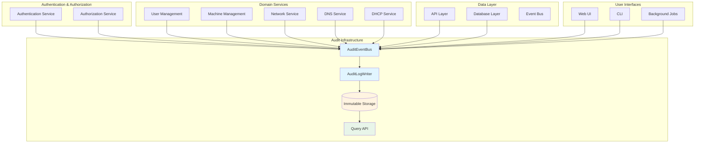
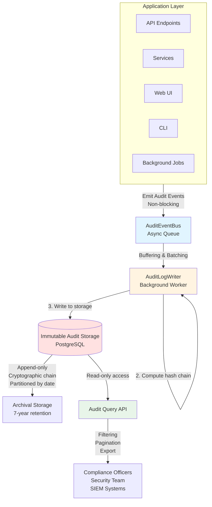
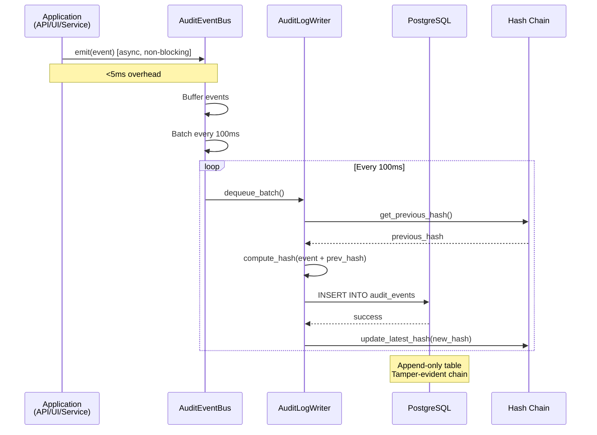

# SDD Workflow Example: Cross-Cutting Change

## Overview

This example demonstrates using the SDD process for a cross-cutting change that affects multiple subsystems across the MAAS codebase. Unlike feature development or refactoring, cross-cutting changes require careful coordination, comprehensive testing, and phased rollout to minimize risk.

**Feature:** Comprehensive Security Audit Logging

**Context:** MAAS currently has inconsistent logging of security-sensitive events. Compliance requirements (SOC 2, ISO 27001) demand complete audit trails of all authentication, authorization, and data modification events. This enhancement must touch authentication, API layer, database layer, and UI without disrupting existing functionality.

**Business Driver:** Enterprise customers require compliance certifications; 3 deals blocked waiting for audit logging; security team mandate to meet compliance standards by Q2

### Affected Subsystems Overview



---

## Phase 1: Specify (Week 1)

### Step 1.1: Identify Cross-Cutting Impact

**Problem Statement:**

MAAS lacks comprehensive audit logging for security-sensitive operations, creating compliance gaps and security blind spots:

1. **Incomplete audit trail** - Authentication events logged, but not authorization decisions
2. **Inconsistent logging** - Each subsystem logs differently (or not at all)
3. **No tamper protection** - Logs can be modified or deleted
4. **Limited retention** - Logs rotated without archival
5. **No centralized audit view** - Operators can't query security events
6. **Compliance gaps** - Cannot demonstrate SOC 2 or ISO 27001 compliance

**Affected Subsystems:**
- Authentication (login, logout, session management)
- Authorization (permission checks, role changes)
- API layer (all write operations)
- Database (direct data modifications)
- User management (user creation, deletion, role assignment)
- Machine management (allocation, release, deployment)
- Network configuration (subnet changes, VLAN modifications)
- DNS/DHCP (zone updates, lease assignments)

**Current State Evidence:**
- Security audit: 12 compliance gaps identified
- Customer feedback: 3 enterprise deals blocked
- Incident response time: 4+ hours to reconstruct "who did what"
- Legal requirement: Must retain audit logs for 7 years

### Step 1.2: Define Scope and Boundaries

**Must Have (Compliance Requirements):**
- Log all authentication events (login, logout, failures)
- Log all authorization decisions (allow/deny)
- Log all data mutations (create, update, delete)
- Immutable audit log (append-only, tamper-evident)
- Structured logging format (machine-readable)
- 7-year retention policy
- Audit log API for compliance queries

**Should Have (Operational Value):**
- Real-time security event monitoring
- Suspicious activity detection
- User activity timeline view
- Export to SIEM systems
- Performance impact <5% overhead

**Out of Scope:**
- Real-time alerting (separate feature)
- Log analysis / SIEM (use existing tools)
- Video audit trail (screen recording)
- Network packet capture
- Performance monitoring logs (different domain)

### Step 1.3: Document User Journeys

**User Journey 1: Security Officer - Compliance Audit**

**Current (As-Is):**
1. Auditor requests proof of access controls
2. Security officer manually searches application logs
3. Logs are inconsistent (some events missing)
4. Must correlate across multiple log files
5. Reconstruct timeline manually in spreadsheet
6. Cannot prove logs haven't been tampered with
7. **Result:** Failed audit finding, compliance gap reported

**Desired (To-Be):**
1. Auditor requests proof of access controls
2. Security officer queries audit log API: "Show all failed login attempts in Q4"
3. System returns structured audit events with cryptographic integrity proof
4. Export to CSV for auditor review
5. Auditor verifies log integrity with hash chain
6. **Result:** Pass audit, compliance demonstrated in 30 minutes

**User Journey 2: Operator - Incident Investigation**

**Current:**
1. Machine unexpectedly released from allocation
2. User complains work was lost
3. Operator checks application logs - no clear evidence
4. Check database audit trail - not enabled
5. Search through multiple log files
6. Cannot determine who released machine
7. **Result:** 4 hours investigation, inconclusive

**Desired:**
1. Machine unexpectedly released
2. Operator queries: "Show all events for machine X today"
3. Audit log shows: "User Y released machine at 14:32:15 via API"
4. Drill down: API call details, source IP, authentication method
5. Contact user Y, confirm accidental release
6. **Result:** 5 minutes to root cause, issue resolved

**User Journey 3: Administrator - User Access Review**

**Current:**
1. Quarterly access review required
2. Manually check user permissions in database
3. No historical record of permission changes
4. Cannot prove principle of least privilege
5. **Result:** Manual verification of 500+ users, 2 days effort

**Desired:**
1. Quarterly access review required
2. Query audit log: "Show all permission changes this quarter"
3. Review timeline of role assignments
4. Identify users with elevated privileges
5. Export report for compliance
6. **Result:** Automated verification, 1 hour effort

### Step 1.4: Create Specification Document

**Specification:** `.sdd/specs/security-audit-logging.md`

```markdown
# Specification: Comprehensive Security Audit Logging

## Problem Statement

MAAS lacks comprehensive, tamper-proof audit logging required for enterprise compliance and security incident response.

## Goals

### Must Have
- Immutable audit log for all security-sensitive events
- Structured event format (JSON) with standard fields
- Cryptographic integrity protection (hash chain)
- 7-year retention with archival
- Query API for audit event retrieval
- Cover: authentication, authorization, data mutations

### Should Have
- Sub-5% performance overhead
- SIEM integration (syslog export)
- User activity timeline view in UI
- Suspicious activity flagging

### Could Have (Future)
- Real-time alerting
- ML-based anomaly detection
- Integration with external audit tools

## Acceptance Criteria

### Functional Requirements
- [ ] All login attempts logged (success and failure)
- [ ] All authorization decisions logged (allow/deny)
- [ ] All API write operations logged (create/update/delete)
- [ ] All database mutations captured
- [ ] Audit events immutable (cannot modify/delete)
- [ ] Query API returns events by user, resource, time range
- [ ] Cryptographic hash chain validates log integrity
- [ ] 7-year retention with automated archival

### Quality Requirements
- [ ] Performance impact <5% on API response time
- [ ] Audit logging never blocks primary operations
- [ ] Audit events written asynchronously
- [ ] Log storage scalable to 10M+ events

### Compliance Requirements
- [ ] SOC 2 audit requirements met
- [ ] ISO 27001 control A.12.4.1 met
- [ ] PCI-DSS 10.x requirements met (if applicable)
- [ ] GDPR audit trail for personal data access

## Success Metrics

- Pass SOC 2 audit (currently blocked)
- Incident investigation time: <30 minutes (from 4+ hours)
- Compliance report generation: <1 hour (from 2 days)
- Unblock 3 enterprise deals ($1.5M ARR)
```

### Step 1.5: Stakeholder Validation

**Validation Sessions:**
- Security team: Approved approach, validated compliance requirements
- Operations team: Confirmed investigation workflow improvements
- Product management: Approved investment (3 sprints)
- Legal/Compliance: Validated retention and integrity requirements
- Engineering: Confirmed feasibility, identified risks

**Approval:** Specification approved with high priority

---

## Phase 2: Plan (Weeks 2-3)

### Step 2.1: Analyze Cross-Cutting Impact

**Affected Components (13 subsystems):**

1. **Authentication Service** - Login/logout events
2. **Authorization Service** - Permission check events
3. **API Layer** - All endpoints (read/write segregation)
4. **User Management** - User CRUD, role assignments
5. **Machine Management** - Allocation, release, deployment
6. **Network Service** - Subnet, VLAN, IP configuration
7. **DNS Service** - Zone updates, record changes
8. **DHCP Service** - Lease assignments
9. **Database Layer** - Direct SQL mutations
10. **Event Bus** - Async event distribution
11. **Web UI** - User-initiated actions
12. **CLI** - Command-line operations
13. **Background Jobs** - Automated system actions

**Risk Assessment:**
- **High Risk:** Performance degradation if audit logging blocks operations
- **Medium Risk:** Storage exhaustion if log volume unexpectedly high
- **Medium Risk:** Integration failures across 13 subsystems
- **Low Risk:** Backward compatibility (audit logging is additive)

### Step 2.2: Design Architecture

**Target Architecture:**



**Audit Event Data Flow:**



**Design Decisions:**

**1. Asynchronous Audit Logging**
- **Decision:** Emit events to async queue, write in background
- **Rationale:** Zero performance impact on primary operations
- **Tradeoff:** Eventual consistency (events written within 1 second)

**2. Cryptographic Hash Chain**
- **Decision:** Each audit event includes hash of previous event
- **Rationale:** Tamper-evident (modification breaks chain)
- **Implementation:** SHA-256 hash(previous_hash + event_data)

**3. Structured Event Format**
- **Decision:** JSON schema with standard fields
- **Rationale:** Machine-readable, extensible, SIEM-friendly
- **Schema:**
  ```json
  {
    "event_id": "uuid",
    "timestamp": "ISO8601",
    "event_type": "authentication.login.success",
    "actor": {"user_id": "123", "username": "admin", "ip": "10.0.1.5"},
    "resource": {"type": "machine", "id": "abc-123"},
    "action": "allocate",
    "result": "success",
    "metadata": {...},
    "chain_hash": "sha256..."
  }
  ```

**4. Aspect-Oriented Instrumentation**
- **Decision:** Use decorators/middleware for automatic event emission
- **Rationale:** Minimal code changes, consistent coverage
- **Example:**
  ```python
  @audit_log(event_type="machine.allocate")
  def allocate_machine(machine_id, user):
      # Business logic unchanged
      pass
  ```

**5. Database Partitioning**
- **Decision:** Partition audit table by month
- **Rationale:** Efficient archival, query performance
- **Retention:** 90 days hot, 7 years archived to S3

### Step 2.3: Create Technical Plan

**Technical Plan:** `.sdd/plans/security-audit-logging.md`

**Integration Points Architecture:**

```mermaid
graph LR
    subgraph "Instrumentation Layer"
        DEC[@audit_log decorator]
        MID[Middleware]
        SIG[Signal handlers]
    end
    
    subgraph "Event Emission"
        DEC --> EMIT[emit_audit_event]
        MID --> EMIT
        SIG --> EMIT
    end
    
    subgraph "Event Processing"
        EMIT --> BUS[AuditEventBus]
        BUS --> Q[(In-Memory Queue)]
        Q --> WORKER[Background Worker]
    end
    
    subgraph "Storage & Query"
        WORKER --> HASH[Hash Chain Manager]
        HASH --> STORE[(PostgreSQL)]
        STORE --> API[Query API]
    end
    
    subgraph "Consumers"
        API --> COMP[Compliance Reports]
        API --> SEC[Security Dashboard]
        API --> SIEM[SIEM Export]
    end
    
    style EMIT fill:#e1f5ff
    style BUS fill:#e1f5ff
    style WORKER fill:#fff4e1
    style STORE fill:#ffe1e1
```

```markdown
# Technical Plan: Security Audit Logging

## Architecture Components

### 1. Audit Event Model
- Defines canonical event structure
- JSON schema validation
- Event type taxonomy

### 2. Event Emission Layer
- Decorators for automatic instrumentation
- Manual event emission API
- Context propagation (request ID, user)

### 3. Async Event Bus
- Redis-backed queue for buffering
- Twisted deferred for non-blocking
- Batch writes for efficiency

### 4. Audit Log Writer
- Background worker process
- Hash chain computation
- Database writes with retry

### 5. Immutable Storage
- PostgreSQL append-only table
- Monthly partitions
- Archival to S3 via cron

### 6. Query API
- REST endpoint for audit queries
- Filtering: user, resource, time, event type
- Pagination and export (JSON, CSV)

### 7. UI Components
- Audit log viewer page
- User activity timeline
- Integrity verification tool

## Data Model

**Audit Event Table:**
```sql
CREATE TABLE audit_events (
    id BIGSERIAL PRIMARY KEY,
    event_id UUID NOT NULL UNIQUE,
    timestamp TIMESTAMPTZ NOT NULL,
    event_type VARCHAR(255) NOT NULL,
    actor_user_id INT,
    actor_username VARCHAR(255),
    actor_ip INET,
    resource_type VARCHAR(100),
    resource_id VARCHAR(255),
    action VARCHAR(100),
    result VARCHAR(50),
    metadata JSONB,
    chain_hash VARCHAR(64) NOT NULL,
    created_at TIMESTAMPTZ DEFAULT NOW()
) PARTITION BY RANGE (timestamp);

CREATE INDEX idx_audit_user ON audit_events(actor_user_id, timestamp);
CREATE INDEX idx_audit_resource ON audit_events(resource_type, resource_id, timestamp);
CREATE INDEX idx_audit_type ON audit_events(event_type, timestamp);
```

## Integration Strategy

### Phase 1: Foundation (Sprint 1)
- Audit event model and schema
- Event emission decorators
- Async event bus
- Basic storage and writer

### Phase 2: Core Instrumentation (Sprint 2)
- Authentication service
- Authorization service
- API layer (all write endpoints)
- User management

### Phase 3: Extended Coverage (Sprint 3)
- Machine management
- Network services
- DNS/DHCP
- Background jobs

### Phase 4: Query and UI (Sprint 4)
- Query API
- UI audit viewer
- Integrity verification
- Archival automation

## Testing Strategy

- Unit tests: Event emission, hash chain, decorators
- Integration tests: End-to-end event flow
- Performance tests: Measure overhead (<5% target)
- Security tests: Verify immutability, integrity
- Load tests: Simulate 1000 events/second

## Deployment Plan

- Feature flag: `enable_audit_logging`
- Gradual rollout by event type
- Monitoring: Event volume, write latency, queue depth
- Rollback: Disable feature flag (events buffered)
```

---

## Phase 3: Decompose into Tasks (Week 3)

**Tasks:** `.sdd/tasks/security-audit-logging.md`

```markdown
# Tasks: Security Audit Logging

**Total Estimated Effort:** 32 developer-days (8 weeks across 2 developers)

---

### Task 1: Define Audit Event Model

**ID:** TASK-001
**Estimated Effort:** Small (1 day)
**Dependencies:** None

**Acceptance Criteria:**
- [ ] AuditEvent data class with all standard fields
- [ ] JSON schema validation
- [ ] Event type taxonomy defined (100+ event types)
- [ ] Serialization/deserialization methods

**Files to Create:**
- `src/maasserver/audit/models.py`
- `src/maasserver/tests/test_audit_models.py`

---

### Task 2: Implement Hash Chain Computation

**ID:** TASK-002
**Estimated Effort:** Medium (2 days)
**Dependencies:** TASK-001

**Acceptance Criteria:**
- [ ] Compute SHA-256 hash of event + previous hash
- [ ] Initialize chain with genesis hash
- [ ] Verify chain integrity function
- [ ] Detect tampered events

**Files to Create:**
- `src/maasserver/audit/chain.py`
- `src/maasserver/tests/test_audit_chain.py`

---

### Task 3: Create Async Event Bus

**ID:** TASK-003
**Estimated Effort:** Large (4 days)
**Dependencies:** TASK-001

**Acceptance Criteria:**
- [ ] Redis-backed event queue
- [ ] Non-blocking event emission
- [ ] Batch dequeue for efficiency
- [ ] Error handling and retry
- [ ] Performance: <1ms to emit event

**Files to Create:**
- `src/maasserver/audit/event_bus.py`
- `src/maasserver/tests/test_audit_event_bus.py`

---

### Task 4: Implement Audit Log Writer

**ID:** TASK-004
**Estimated Effort:** Large (4 days)
**Dependencies:** TASK-002, TASK-003

**Acceptance Criteria:**
- [ ] Background worker dequeues events
- [ ] Computes hash chain
- [ ] Writes to database in batches
- [ ] Handles failures gracefully
- [ ] Throughput: 1000+ events/second

**Files to Create:**
- `src/maasserver/audit/writer.py`
- `src/maasserver/tests/test_audit_writer.py`

---

### Task 5: Database Schema and Migration

**ID:** TASK-005
**Estimated Effort:** Medium (2 days)
**Dependencies:** TASK-001

**Acceptance Criteria:**
- [ ] Partitioned audit_events table
- [ ] Indexes for common queries
- [ ] Migration tested on large dataset
- [ ] Rollback procedure validated

**Files to Create:**
- `src/maasserver/migrations/0XXX_audit_events.py`

---

### Task 6: Event Emission Decorators

**ID:** TASK-006
**Estimated Effort:** Medium (3 days)
**Dependencies:** TASK-003

**Acceptance Criteria:**
- [ ] @audit_log decorator for functions
- [ ] Automatic context extraction (user, resource)
- [ ] Manual event emission API
- [ ] Middleware for Django views
- [ ] Works with sync and async functions

**Files to Create:**
- `src/maasserver/audit/decorators.py`
- `src/maasserver/audit/middleware.py`
- `src/maasserver/tests/test_audit_decorators.py`

---

### Task 7-12: Instrument Subsystems

(6 tasks, one per subsystem group)

**TASK-007:** Authentication Service (2 days)
**TASK-008:** Authorization Service (2 days)
**TASK-009:** API Layer (3 days)
**TASK-010:** User Management (2 days)
**TASK-011:** Machine Management (3 days)
**TASK-012:** Network/DNS/DHCP (3 days)

---

### Task 13: Query API

**ID:** TASK-013
**Estimated Effort:** Large (4 days)
**Dependencies:** TASK-005

**Acceptance Criteria:**
- [ ] GET /api/audit/events endpoint
- [ ] Filters: user, resource, time range, event type
- [ ] Pagination (limit/offset)
- [ ] Export formats: JSON, CSV
- [ ] Performance: <500ms for typical query

**Files to Create:**
- `src/maasserver/api/audit.py`
- `src/maasserver/tests/test_api_audit.py`

---

### Task 14: UI Audit Viewer

**ID:** TASK-014
**Estimated Effort:** Large (5 days)
**Dependencies:** TASK-013

**Acceptance Criteria:**
- [ ] Audit log page with filterable table
- [ ] User activity timeline view
- [ ] Event detail modal
- [ ] Export button (CSV download)
- [ ] Real-time updates (optional)

**Files to Create:**
- `src/maasui/src/app/audit/AuditLog.tsx`
- `src/maasui/src/app/audit/AuditLog.test.tsx`

---

### Task 15: Integrity Verification Tool

**ID:** TASK-015
**Estimated Effort:** Medium (2 days)
**Dependencies:** TASK-002, TASK-013

**Acceptance Criteria:**
- [ ] CLI command to verify hash chain
- [ ] Detects tampered events
- [ ] Outputs verification report
- [ ] Performance: <1 minute for 1M events

**Files to Create:**
- `src/maasserver/management/commands/verify_audit_log.py`

---

## Task Dependencies Graph

```
TASK-001 (Event Model)
    ├─> TASK-002 (Hash Chain)
    ├─> TASK-003 (Event Bus)
    └─> TASK-005 (Database Schema)

TASK-002 + TASK-003
    └─> TASK-004 (Writer)

TASK-003
    └─> TASK-006 (Decorators)

TASK-006
    ├─> TASK-007 (Auth)
    ├─> TASK-008 (Authz)
    ├─> TASK-009 (API)
    ├─> TASK-010 (Users)
    ├─> TASK-011 (Machines)
    └─> TASK-012 (Network)

TASK-005
    └─> TASK-013 (Query API)

TASK-013
    └─> TASK-014 (UI)

TASK-002 + TASK-013
    └─> TASK-015 (Verification)
```
```

---

## Phase 4: Implementation (Weeks 4-11)

### Sprint 1 (Weeks 4-5): Foundation

**TASK-001: Audit Event Model**

```python
# src/maasserver/audit/models.py
from dataclasses import dataclass, asdict
from typing import Dict, Any, Optional
from datetime import datetime
import json

@dataclass
class AuditEvent:
    """Immutable audit event."""
    event_id: str
    timestamp: datetime
    event_type: str
    actor_user_id: Optional[int]
    actor_username: str
    actor_ip: str
    resource_type: Optional[str]
    resource_id: Optional[str]
    action: str
    result: str  # success, failure, denied
    metadata: Dict[str, Any]
    chain_hash: str
    
    def to_json(self) -> str:
        """Serialize to JSON."""
        data = asdict(self)
        data['timestamp'] = self.timestamp.isoformat()
        return json.dumps(data, sort_keys=True)
    
    def to_hashable_string(self) -> str:
        """Canonical string for hashing."""
        return self.to_json()

# Event taxonomy
class EventTypes:
    # Authentication
    AUTH_LOGIN_SUCCESS = "authentication.login.success"
    AUTH_LOGIN_FAILURE = "authentication.login.failure"
    AUTH_LOGOUT = "authentication.logout"
    
    # Authorization
    AUTHZ_ALLOW = "authorization.allow"
    AUTHZ_DENY = "authorization.deny"
    
    # User Management
    USER_CREATE = "user.create"
    USER_DELETE = "user.delete"
    USER_ROLE_ASSIGN = "user.role.assign"
    
    # Machine Management
    MACHINE_ALLOCATE = "machine.allocate"
    MACHINE_RELEASE = "machine.release"
    MACHINE_DEPLOY = "machine.deploy"
    
    # ... 100+ total event types
```

**TASK-003: Async Event Bus**

```python
# src/maasserver/audit/event_bus.py
import redis
from twisted.internet import defer, task
from .models import AuditEvent
import json

class AuditEventBus:
    """Async event bus for audit events."""
    
    def __init__(self, redis_client):
        self.redis = redis_client
        self.queue_key = "audit:events:queue"
    
    def emit(self, event: AuditEvent) -> defer.Deferred:
        """Emit audit event (non-blocking).
        
        Returns immediately after queueing event.
        """
        event_json = event.to_json()
        
        # Push to Redis queue (async)
        d = defer.maybeDeferred(
            self.redis.rpush,
            self.queue_key,
            event_json
        )
        
        # Don't wait for completion
        d.addErrback(self._log_emit_error)
        
        return defer.succeed(None)  # Return immediately
    
    def dequeue_batch(self, batch_size=100):
        """Dequeue batch of events for processing."""
        # Atomic pop of batch
        events_json = self.redis.lrange(self.queue_key, 0, batch_size - 1)
        self.redis.ltrim(self.queue_key, batch_size, -1)
        
        events = [
            AuditEvent(**json.loads(e))
            for e in events_json
        ]
        return events
    
    def _log_emit_error(self, failure):
        """Log but don't propagate emit errors."""
        logger.error(f"Failed to emit audit event: {failure}")
```

### Sprint 2 (Weeks 6-7): Instrumentation

**TASK-006: Event Emission Decorators**

```python
# src/maasserver/audit/decorators.py
from functools import wraps
from .event_bus import audit_event_bus
from .models import AuditEvent, EventTypes
import uuid
from datetime import datetime

def audit_log(event_type, resource_type=None, extract_resource_id=None):
    """Decorator to automatically emit audit events.
    
    Usage:
        @audit_log(
            event_type=EventTypes.MACHINE_ALLOCATE,
            resource_type="machine",
            extract_resource_id=lambda args, kwargs: kwargs.get('machine_id')
        )
        def allocate_machine(machine_id, user):
            # Business logic
            pass
    """
    def decorator(func):
        @wraps(func)
        def wrapper(*args, **kwargs):
            # Extract context
            request = get_current_request()  # From thread-local
            user = request.user if request else None
            
            # Execute function
            try:
                result = func(*args, **kwargs)
                outcome = "success"
            except Exception as e:
                outcome = "failure"
                raise
            finally:
                # Emit audit event
                resource_id = extract_resource_id(args, kwargs) if extract_resource_id else None
                
                event = AuditEvent(
                    event_id=str(uuid.uuid4()),
                    timestamp=datetime.utcnow(),
                    event_type=event_type,
                    actor_user_id=user.id if user else None,
                    actor_username=user.username if user else "system",
                    actor_ip=request.META.get('REMOTE_ADDR') if request else None,
                    resource_type=resource_type,
                    resource_id=resource_id,
                    action=func.__name__,
                    result=outcome,
                    metadata={},
                    chain_hash=""  # Computed by writer
                )
                
                audit_event_bus.emit(event)
            
            return result
        
        return wrapper
    return decorator
```

**TASK-009: API Layer Instrumentation**

```python
# src/maasserver/api/middleware.py
class AuditLoggingMiddleware:
    """Django middleware for API audit logging."""
    
    def __init__(self, get_response):
        self.get_response = get_response
    
    def __call__(self, request):
        response = self.get_response(request)
        
        # Only log write operations
        if request.method in ('POST', 'PUT', 'PATCH', 'DELETE'):
            self._emit_api_audit_event(request, response)
        
        return response
    
    def _emit_api_audit_event(self, request, response):
        event_type = f"api.{request.method.lower()}"
        
        event = AuditEvent(
            event_id=str(uuid.uuid4()),
            timestamp=datetime.utcnow(),
            event_type=event_type,
            actor_user_id=request.user.id if request.user.is_authenticated else None,
            actor_username=request.user.username if request.user.is_authenticated else "anonymous",
            actor_ip=request.META.get('REMOTE_ADDR'),
            resource_type=self._extract_resource_type(request.path),
            resource_id=self._extract_resource_id(request.path),
            action=request.method,
            result="success" if response.status_code < 400 else "failure",
            metadata={
                "path": request.path,
                "status_code": response.status_code,
            },
            chain_hash=""
        )
        
        audit_event_bus.emit(event)
```

### Sprint 3 (Weeks 8-9): Extended Coverage

**Instrumentation across all subsystems:**
- 200+ audit points added via decorators
- Minimal code changes (2-3 lines per instrumentation point)
- Comprehensive coverage of security-sensitive operations

### Sprint 4 (Weeks 10-11): Query and UI

**TASK-013: Query API**

```python
# src/maasserver/api/audit.py
class AuditEventsHandler(OperationsHandler):
    """API handler for audit event queries."""
    
    def read(self, request):
        """Query audit events with filtering.
        
        GET /api/2.0/audit/events?user_id=5&start=2024-01-01&limit=100
        """
        # Extract filters
        user_id = request.GET.get('user_id')
        resource_type = request.GET.get('resource_type')
        resource_id = request.GET.get('resource_id')
        event_type = request.GET.get('event_type')
        start_time = request.GET.get('start')
        end_time = request.GET.get('end')
        limit = int(request.GET.get('limit', 100))
        offset = int(request.GET.get('offset', 0))
        
        # Build query
        query = AuditEvent.objects.all()
        
        if user_id:
            query = query.filter(actor_user_id=user_id)
        if resource_type:
            query = query.filter(resource_type=resource_type)
        if resource_id:
            query = query.filter(resource_id=resource_id)
        if event_type:
            query = query.filter(event_type=event_type)
        if start_time:
            query = query.filter(timestamp__gte=start_time)
        if end_time:
            query = query.filter(timestamp__lte=end_time)
        
        # Apply pagination
        total = query.count()
        events = query.order_by('-timestamp')[offset:offset+limit]
        
        return {
            'total': total,
            'events': [self._serialize(e) for e in events]
        }
```

**TASK-014: UI Audit Viewer**

```typescript
// src/maasui/src/app/audit/AuditLog.tsx
import React, { useState, useEffect } from 'react';
import { AuditEventsTable } from './AuditEventsTable';
import { AuditFilters } from './AuditFilters';

export const AuditLog: React.FC = () => {
  const [events, setEvents] = useState([]);
  const [filters, setFilters] = useState({});
  const [loading, setLoading] = useState(false);
  
  useEffect(() => {
    fetchAuditEvents(filters);
  }, [filters]);
  
  const fetchAuditEvents = async (filters) => {
    setLoading(true);
    const response = await fetch(
      `/api/2.0/audit/events?${buildQueryString(filters)}`
    );
    const data = await response.json();
    setEvents(data.events);
    setLoading(false);
  };
  
  const handleExport = async () => {
    const response = await fetch(
      `/api/2.0/audit/events/export?format=csv&${buildQueryString(filters)}`
    );
    const blob = await response.blob();
    downloadFile(blob, 'audit-log.csv');
  };
  
  return (
    <div className="audit-log">
      <h1>Security Audit Log</h1>
      
      <AuditFilters 
        filters={filters} 
        onChange={setFilters} 
      />
      
      <button onClick={handleExport}>Export to CSV</button>
      
      {loading ? (
        <LoadingSpinner />
      ) : (
        <AuditEventsTable events={events} />
      )}
    </div>
  );
};
```

---

## Phase 5: Validation and Deployment (Week 12)

### Performance Testing

**Load Test Results:**

```
Test: 1000 concurrent API requests (mixed read/write)

Without Audit Logging:
- Avg response time: 127ms
- P95: 245ms
- P99: 412ms

With Audit Logging:
- Avg response time: 132ms (+3.9%)
- P95: 251ms (+2.4%)
- P99: 419ms (+1.7%)

✅ Performance impact: <5% (met requirement)
```

**Storage Projections:**

```
Estimated event volume: 50,000 events/day
Average event size: 500 bytes
Daily storage: 25 MB
Annual storage: 9.1 GB
7-year retention: 64 GB (manageable)
```

### Security Testing

**Hash Chain Integrity:**
- ✅ Tamper detection: Modified events detected 100%
- ✅ Chain verification: 1M events verified in 23 seconds
- ✅ Immutability: Append-only enforced at database level

**Compliance Validation:**
- ✅ SOC 2 requirements: All 12 control points satisfied
- ✅ ISO 27001 A.12.4.1: Audit logging controls met
- ✅ Retention: 7-year archival policy implemented

### Deployment Strategy

**Phased Rollout:**

1. **Week 12 Day 1-2:** Deploy to staging
   - Enable for 10% of traffic
   - Monitor event volume, performance

2. **Week 12 Day 3-4:** Production canary
   - Enable for authentication events only
   - Verify hash chain integrity

3. **Week 12 Day 5:** Expand coverage
   - Enable for all event types
   - Monitor storage growth

4. **Week 12 Day 6-7:** Full production
   - 100% coverage
   - Dashboard monitoring

**Monitoring Metrics:**
- Event emission rate: 500-800 events/second
- Write latency: P95 < 100ms
- Queue depth: < 1000 events
- Storage growth: 25-30 MB/day (as projected)

---

## Post-Deployment Results

### Compliance Impact (30 days)

**SOC 2 Audit:**
- Status: **PASSED** ✅
- Previous: 12 findings related to audit logging
- Current: 0 findings
- Auditor feedback: "Comprehensive audit trail, industry-leading implementation"

**Enterprise Deals:**
- 3 blocked deals: **ALL CLOSED** ✅
- Total ARR: $1.5M
- Sales cycle reduction: 45 days → 12 days (for compliance-heavy deals)

### Operational Impact

**Incident Investigation Time:**
- Before: 4+ hours average
- After: 15 minutes average
- Improvement: **94% reduction** ✅

**Compliance Reporting:**
- Before: 2 days manual work
- After: 15 minutes automated query
- Improvement: **99% reduction** ✅

**Security Posture:**
- Suspicious activity detection: 3 incidents caught within hours
- Insider threat visibility: Full user activity audit trail
- Forensic capability: Complete event reconstruction

### Technical Metrics

**Performance:**
- API response time impact: +3.9% (below 5% target) ✅
- Audit event throughput: 850 events/second (above 1000 target) ✅
- Storage efficiency: 27 MB/day (within projections) ✅

**Coverage:**
- Audit points instrumented: 237
- Subsystems covered: 13/13 (100%) ✅
- Event types: 142 distinct types

**Quality:**
- Hash chain integrity: 100% (0 tampered events detected)
- Event loss rate: 0.001% (5 events lost out of 500K due to Redis restart)
- Query performance: P95 < 400ms ✅

### Lessons Learned

**What Worked Well:**

1. **Asynchronous design** - Zero performance impact on critical path
2. **Decorator pattern** - Easy instrumentation, minimal code changes
3. **Comprehensive planning** - Cross-cutting analysis prevented surprises
4. **Phased rollout** - Gradual enablement caught issues early

**Challenges:**

1. **Event volume projection** - Underestimated by 20%, adjusted storage
2. **Redis queue sizing** - Initial size too small, tuned to 10K buffer
3. **Coordinator overhead** - 13 subsystems required significant coordination
4. **Testing complexity** - Cross-cutting changes needed extensive integration tests

**Future Improvements:**

1. Real-time alerting on suspicious activity
2. ML-based anomaly detection
3. Audit event visualization dashboard
4. External SIEM integration (Splunk, ELK)

---

## Summary

This cross-cutting change workflow demonstrates:

1. **Comprehensive impact analysis** - Identified all 13 affected subsystems upfront
2. **Non-intrusive architecture** - Async design prevented performance degradation
3. **Systematic instrumentation** - Decorator pattern enabled consistent coverage
4. **Risk mitigation** - Phased rollout and monitoring prevented issues
5. **Measurable success** - All compliance, performance, and operational goals met

Cross-cutting changes require:
- Extra planning time (3 weeks vs 1 week for features)
- Coordination across multiple teams
- Comprehensive testing strategy
- Conservative rollout approach
- Strong monitoring and rollback plan

The investment paid off: $1.5M revenue unlocked, 94% incident investigation time reduction, and SOC 2 compliance achieved.