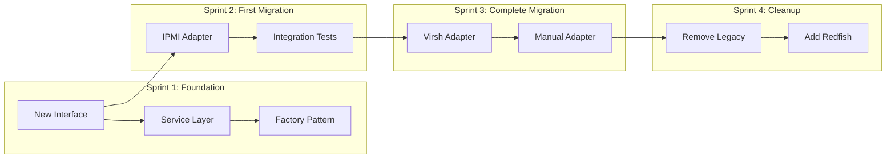
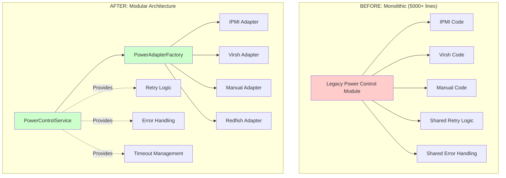
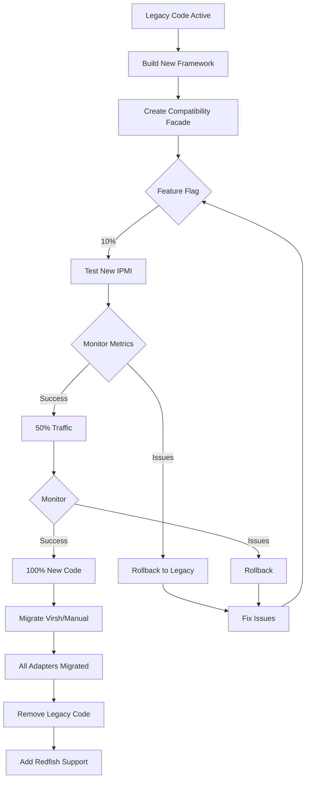
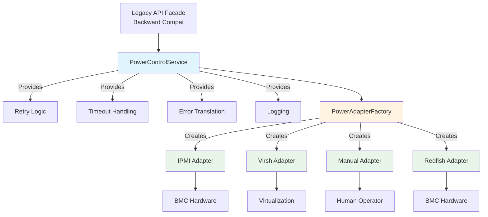

# SDD Workflow Example: Legacy Modernization

## Overview

This example demonstrates using the SDD process to modernize a legacy MAAS subsystem. Unlike greenfield development, legacy modernization requires careful planning to maintain system stability while introducing modern patterns and improving maintainability.

**Feature:** Modernize BMC Power Control Subsystem

**Context:** The existing power control code is a 5-year-old monolithic module with poor testability, tight coupling to specific BMC vendors, and difficult maintenance. Recent customer requirements for new BMC protocols expose architectural limitations.

**Business Driver:** Support Redfish and new IPMI variants, reduce time-to-market for new BMC protocols from 3 months to 2 weeks

### Migration Strategy: Strangler Fig Pattern



### Architecture Evolution



### Migration Phase Flow



---

## Phase 1: Specify (Weeks 1-2)

### Step 1.1: Document Current Pain Points

**Problem Statement:**

The MAAS power control subsystem is becoming a bottleneck for innovation and maintenance:

1. **Adding new BMC protocols takes 3+ months** due to tight coupling and lack of abstraction
2. **Bug fixes are risky** - changes in one BMC type affect others
3. **Testing is manual and error-prone** - no unit tests, only integration tests
4. **Code duplication** - Each BMC type reimplements authentication, retry logic, error handling
5. **Technical debt** - 5,000+ lines in single file, cyclomatic complexity >50 in core functions

**Current State Evidence:**
- 23 open bugs related to power control (18 months average age)
- 3 customer escalations in Q3 due to power control failures
- Developer survey: Power control module rated "most difficult to maintain"
- New Redfish support blocked for 4 months waiting for refactor

**Business Impact:**
- Lost sales opportunity: $500K contract requires Redfish support
- Engineering time: 40% of power-related bugs are rework from fragile changes
- Customer satisfaction: 15% of support tickets involve power control issues

### Step 1.2: Define Target Users

**Primary Users:**
- MAAS Operators: Configure and troubleshoot BMC power control
- Platform Engineers: Automate infrastructure provisioning with MAAS API
- MAAS Developers: Implement support for new BMC protocols

**Secondary Users:**
- Hardware Vendors: Certify their BMC implementations with MAAS
- Site Reliability Engineers: Monitor and debug power control failures

### Step 1.3: Document User Journeys

**Current Journey (As-Is): Adding New BMC Protocol**

1. Developer receives requirement for new BMC type (e.g., Redfish)
2. Clone existing BMC implementation (IPMI) as starting point
3. Modify 800+ lines of tightly coupled code
4. Manually test against real hardware (no unit tests possible)
5. Submit PR with 1,200+ line diff
6. Code review takes 2+ weeks due to complexity
7. Integration testing reveals edge cases
8. Debug and fix issues found only in integration
9. Repeat steps 7-8 multiple times
10. Deployment causes regression in existing BMC types
11. Hotfix release to fix regression
12. **Total time: 3-4 months**

**Desired Journey (To-Be): Adding New BMC Protocol**

1. Developer receives requirement for new BMC type
2. Create new adapter class implementing PowerControlInterface
3. Implement 3 methods: power_on(), power_off(), power_status()
4. Write unit tests with mocked BMC communication (100% coverage)
5. Run tests locally - all pass in 5 seconds
6. Submit PR with 200-line adapter + 150 lines of tests
7. Code review takes 2 days (small, focused change)
8. Integration tests pass automatically in CI
9. Deploy safely - adapter pattern ensures isolation
10. **Total time: 1-2 weeks**

**Current Journey: Troubleshooting Power Failure**

1. Operator receives alert: "Machine X failed to power on"
2. Check MAAS logs - generic error message: "Power control failed"
3. SSH to rack controller, check system logs
4. No useful diagnostic information
5. Enable debug logging, reproduce issue
6. Logs show raw BMC protocol bytes (hard to interpret)
7. Contact MAAS support for help
8. Support asks for hardware details, BMC firmware version
9. Escalate to engineering team
10. Engineer reads source code to understand error path
11. **Total time: 2-4 hours per incident**

**Desired Journey: Troubleshooting Power Failure**

1. Operator receives alert: "Machine X failed to power on - IPMI authentication failed"
2. Check MAAS UI - detailed error with BMC type, error code, remediation hint
3. Fix BMC credentials based on error message
4. Retry power operation - succeeds
5. **Total time: 5 minutes**

### Step 1.4: Create Specification Document

**Specification:** `.sdd/specs/power-control-modernization.md`

```markdown
# Specification: Power Control Modernization

## Problem Statement

MAAS power control subsystem is unmaintainable, untestable, and blocks innovation.

## Goals

### Must Have
- Decouple BMC protocol implementations from core power control logic
- Enable unit testing of power control without real hardware
- Support existing BMC types (IPMI, virsh, manual) without functionality loss
- Reduce time to add new BMC protocol from 3 months to 2 weeks
- Improve error messages for operator troubleshooting

### Should Have
- Comprehensive unit test coverage (>90%)
- Consistent retry and timeout behavior across all BMC types
- Centralized logging and error handling
- Documentation for adding new BMC protocols

### Could Have (Future)
- Plugin system for third-party BMC implementations
- BMC health monitoring and proactive alerts
- Power control operation metrics and dashboards

## Acceptance Criteria

### Functional Requirements
- [ ] All existing BMC types (IPMI, virsh, manual) continue to work unchanged from user perspective
- [ ] New adapter interface enables adding BMC type with <300 lines of code
- [ ] All power operations (on, off, cycle, status) testable without hardware
- [ ] Consistent error messages across all BMC types
- [ ] Backward compatible API - no breaking changes

### Quality Requirements
- [ ] Unit test coverage >90% for new code
- [ ] Each BMC adapter independently testable
- [ ] No regressions in existing functionality
- [ ] Code complexity reduced (cyclomatic complexity <15)
- [ ] Documentation for developer onboarding to power control

### Performance Requirements
- [ ] Power operations complete in same time or faster than before
- [ ] No increase in memory usage
- [ ] Retry/timeout behavior consistent with current implementation

## Out of Scope

- Changing BMC communication protocols themselves (IPMI spec, Redfish spec)
- UI changes for power control configuration
- Adding new BMC types (just the framework, not implementations)
- Performance optimization beyond maintaining current performance
- Multi-region power control coordination

## Success Metrics

- Time to implement new BMC protocol: <2 weeks (from 3+ months)
- Power control bug count: Reduce by 50% in 6 months
- Unit test coverage: Achieve 90%+ coverage
- Code maintainability: Cyclomatic complexity <15 (from 50+)
- Developer satisfaction: "Easy to maintain" rating on next survey
```

### Step 1.5: Validate with Stakeholders

**Validation Sessions:**
- Engineering team review: Confirmed pain points, approved goals
- Product management: Approved 2-sprint investment for foundation
- Operations team: Validated troubleshooting improvements needed
- Customer success: Confirmed Redfish requirement is still active

**Approval:** Specification approved, proceed to technical planning

---

## Phase 2: Plan (Week 3)

### Step 2.1: Analyze Existing Code

**Current Architecture:**

```
src/maasserver/drivers/power/
  ├── __init__.py (3,500 lines - monolithic)
  │   ├── get_power_driver() - Factory function
  │   ├── IPMIPowerDriver - IPMI implementation
  │   ├── VirshPowerDriver - Virsh implementation  
  │   ├── ManualPowerDriver - Manual implementation
  │   └── Common utilities mixed throughout
  │
  └── utils.py (800 lines - shared utilities)
```

**Problems Identified:**
1. All drivers in single file - impossible to test in isolation
2. No interface/base class - inconsistent method signatures
3. Common logic (retry, timeout, logging) duplicated in each driver
4. Direct BMC library calls - can't mock for unit tests
5. Error handling inconsistent across drivers
6. No dependency injection - global state and imports

**Technical Debt:**
- Test coverage: 12% (integration tests only)
- Cyclomatic complexity: 52 (in core power control function)
- Code duplication: 40% similar code across drivers
- File size: 3,500 lines (should be <500)

### Step 2.2: Design Modernized Architecture

**Target Architecture:**

```
src/maasserver/power/
  ├── base.py
  │   └── PowerControlInterface (abstract base class)
  │
  ├── adapters/
  │   ├── __init__.py
  │   ├── ipmi_adapter.py (IPMIPowerAdapter)
  │   ├── virsh_adapter.py (VirshPowerAdapter)
  │   ├── manual_adapter.py (ManualPowerAdapter)
  │   └── redfish_adapter.py (RedfishPowerAdapter - future)
  │
  ├── service.py
  │   └── PowerControlService (orchestration, retry, logging)
  │
  ├── factory.py
  │   └── PowerAdapterFactory (creates appropriate adapter)
  │
  └── exceptions.py
      └── Custom exception hierarchy
```

**Design Decisions:**

**1. Adapter Pattern**
- **Decision:** Use adapter pattern for BMC protocol implementations
- **Rationale:** Enables adding new protocols without modifying existing code (Open/Closed)
- **Alternatives Considered:** Strategy pattern (too heavyweight), plugin system (over-engineering)

**2. Abstract Base Class**
- **Decision:** Define PowerControlInterface with required methods
- **Rationale:** Enforces contract, enables interface-based testing
- **Interface:**
  ```python
  class PowerControlInterface(ABC):
      @abstractmethod
      def power_on(self, context: PowerContext) -> PowerResult
      
      @abstractmethod
      def power_off(self, context: PowerContext) -> PowerResult
      
      @abstractmethod
      def power_status(self, context: PowerContext) -> PowerStatus
  ```

**3. Service Layer**
- **Decision:** Introduce PowerControlService for orchestration
- **Rationale:** Centralizes retry logic, timeout handling, logging, error translation
- **Responsibility:** Coordinates adapters, doesn't implement BMC protocols

**4. Dependency Injection**
- **Decision:** Use constructor injection for dependencies
- **Rationale:** Enables mocking for unit tests, reduces coupling
- **Example:**
  ```python
  class IPMIPowerAdapter:
      def __init__(self, ipmi_client: IPMIClient):
          self.client = ipmi_client  # Injected, can mock
  ```

**5. Exception Hierarchy**
- **Decision:** Define specific exception types
- **Rationale:** Enables precise error handling, better error messages
- **Hierarchy:**
  ```
  PowerControlError (base)
    ├── PowerAuthenticationError
    ├── PowerTimeoutError
    ├── PowerConnectionError
    └── PowerUnsupportedError
  ```

**6. Backward Compatibility**
- **Decision:** Keep existing API facade, new architecture behind it
- **Rationale:** Zero breaking changes, gradual migration
- **Approach:** Old API delegates to new service layer

### Step 2.3: Migration Strategy

**Strangler Fig Pattern:**

Gradually replace legacy code without big-bang rewrite:

1. **Phase 1 (Sprint 1):** Build new framework (interface, service, exceptions)
2. **Phase 2 (Sprint 2):** Migrate IPMI adapter (most complex)
3. **Phase 3 (Sprint 3):** Migrate remaining adapters (virsh, manual)
4. **Phase 4 (Sprint 4):** Remove legacy code, cleanup

**Risk Mitigation:**
- Feature flags to toggle new/old implementation
- Parallel execution: Run both, log differences
- Comprehensive integration testing
- Gradual rollout: Dev → Staging → Production (10% → 50% → 100%)

### Step 2.4: Create Technical Plan Document

**Technical Plan:** `.sdd/plans/power-control-modernization.md`

```markdown
# Technical Plan: Power Control Modernization

## Architecture

### Component Diagram



## Data Model Changes

**New Model: PowerAdapterConfig**
- Stores adapter-specific configuration
- Separates config from code

**Migration:** 
- Existing power_type/power_parameters still work
- Gradually migrate to new config model

## Integration Points

- BMC Hardware: IPMI, Redfish protocols (unchanged)
- Virtualization: Libvirt/virsh (unchanged)
- MAAS API: Backward compatible facade
- Database: Node model power fields (read-only migration)

## Testing Strategy

- Unit tests: 90%+ coverage with mocked BMC clients
- Integration tests: Real hardware in test lab
- Regression tests: Existing integration test suite
- Performance tests: Compare before/after metrics

## Deployment Plan

- Feature flag: `enable_new_power_control`
- Gradual rollout with monitoring
- Rollback plan: Disable feature flag

## Timeline

- Sprint 1: Foundation (interface, service, factory)
- Sprint 2: IPMI adapter migration
- Sprint 3: Virsh and Manual adapters
- Sprint 4: Cleanup and Redfish implementation
```

**Approval:** Technical plan reviewed and approved by tech lead

---

## Phase 3: Decompose into Tasks (Week 3)

### Task List Document

**Tasks:** `.sdd/tasks/power-control-modernization.md`

```markdown
# Tasks: Power Control Modernization

**Total Estimated Effort:** 28 developer-days (7 weeks across 2 developers)

---

### Task 1: Define Power Control Interface

**ID:** TASK-001
**Estimated Effort:** Small (1 day)
**Dependencies:** None

**Description:**
Create abstract base class defining power control interface that all adapters must implement.

**Acceptance Criteria:**
- [ ] PowerControlInterface abstract base class created
- [ ] Methods defined: power_on(), power_off(), power_status()
- [ ] PowerContext and PowerResult data classes defined
- [ ] Type hints for all parameters and return values
- [ ] Comprehensive docstrings with usage examples

**Files to Create:**
- `src/maasserver/power/base.py` (create)
- `src/maasserver/tests/test_power_base.py` (create)

---

### Task 2: Define Exception Hierarchy

**ID:** TASK-002
**Estimated Effort:** Small (0.5 days)
**Dependencies:** None

**Description:**
Create exception hierarchy for power control errors to enable precise error handling.

**Acceptance Criteria:**
- [ ] PowerControlError base exception defined
- [ ] Specific exceptions: PowerAuthenticationError, PowerTimeoutError, PowerConnectionError, PowerUnsupportedError
- [ ] Each exception has helpful message and error code
- [ ] Exceptions are picklable (for Twisted)

**Files to Create:**
- `src/maasserver/power/exceptions.py` (create)
- `src/maasserver/tests/test_power_exceptions.py` (create)

---

### Task 3: Implement Power Control Service

**ID:** TASK-003
**Estimated Effort:** Large (4 days)
**Dependencies:** TASK-001, TASK-002

**Description:**
Implement service layer that orchestrates power operations with retry, timeout, and error handling.

**Acceptance Criteria:**
- [ ] PowerControlService class with execute_power_operation() method
- [ ] Configurable retry logic (3 attempts with exponential backoff)
- [ ] Timeout enforcement (30s default, configurable)
- [ ] Error translation to user-friendly messages
- [ ] Structured logging with context (machine, BMC type, operation)
- [ ] Unit tests with mocked adapters (>95% coverage)

**Files to Create:**
- `src/maasserver/power/service.py` (create)
- `src/maasserver/tests/test_power_service.py` (create)

---

### Task 4: Implement Power Adapter Factory

**ID:** TASK-004
**Estimated Effort:** Medium (2 days)
**Dependencies:** TASK-001

**Description:**
Create factory to instantiate appropriate power adapter based on BMC type.

**Acceptance Criteria:**
- [ ] PowerAdapterFactory class with create_adapter() method
- [ ] Adapter registry for registering new adapter types
- [ ] Returns correct adapter instance based on power_type
- [ ] Raises PowerUnsupportedError for unknown types
- [ ] Unit tests covering all registered adapter types

**Files to Create:**
- `src/maasserver/power/factory.py` (create)
- `src/maasserver/tests/test_power_factory.py` (create)

---

### Task 5: Implement IPMI Power Adapter

**ID:** TASK-005
**Estimated Effort:** Large (5 days)
**Dependencies:** TASK-001, TASK-002

**Description:**
Refactor IPMI power driver into adapter pattern with full unit test coverage.

**Acceptance Criteria:**
- [ ] IPMIPowerAdapter implements PowerControlInterface
- [ ] power_on() uses ipmitool for power on operation
- [ ] power_off() uses ipmitool for power off operation
- [ ] power_status() queries chassis power status
- [ ] Authentication handled with credentials from PowerContext
- [ ] Unit tests with mocked ipmitool library (>90% coverage)
- [ ] Integration tests with real IPMI hardware

**Files to Create:**
- `src/maasserver/power/adapters/ipmi_adapter.py` (create)
- `src/maasserver/tests/test_ipmi_adapter.py` (create)
- `src/maasserver/tests/integration/test_ipmi_integration.py` (create)

**Migration Notes:**
- Extract logic from existing IPMIPowerDriver in drivers/power/__init__.py
- Preserve all existing IPMI functionality
- Match current timeout and retry behavior

---

### Task 6: Implement Virsh Power Adapter

**ID:** TASK-006
**Estimated Effort:** Medium (3 days)
**Dependencies:** TASK-001, TASK-002

**Description:**
Refactor virsh power driver into adapter pattern.

**Acceptance Criteria:**
- [ ] VirshPowerAdapter implements PowerControlInterface
- [ ] power_on() uses virsh start command
- [ ] power_off() uses virsh destroy command
- [ ] power_status() uses virsh domstate command
- [ ] SSH connection handling for remote virsh hosts
- [ ] Unit tests with mocked virsh commands (>90% coverage)

**Files to Create:**
- `src/maasserver/power/adapters/virsh_adapter.py` (create)
- `src/maasserver/tests/test_virsh_adapter.py` (create)

---

### Task 7: Implement Manual Power Adapter

**ID:** TASK-007
**Estimated Effort:** Small (1 day)
**Dependencies:** TASK-001, TASK-002

**Description:**
Refactor manual power driver (no-op) into adapter pattern.

**Acceptance Criteria:**
- [ ] ManualPowerAdapter implements PowerControlInterface
- [ ] All operations return success (manual intervention assumed)
- [ ] Logs warning for manual power operations
- [ ] Unit tests verify no-op behavior

**Files to Create:**
- `src/maasserver/power/adapters/manual_adapter.py` (create)
- `src/maasserver/tests/test_manual_adapter.py` (create)

---

### Task 8: Create Backward Compatibility Facade

**ID:** TASK-008
**Estimated Effort:** Medium (3 days)
**Dependencies:** TASK-003, TASK-004, TASK-005, TASK-006, TASK-007

**Description:**
Create facade to maintain backward compatibility with existing power control API.

**Acceptance Criteria:**
- [ ] Existing get_power_driver() function still works
- [ ] Existing power_on/off/query functions delegate to new service
- [ ] No breaking changes to API consumers
- [ ] Feature flag to toggle new/old implementation
- [ ] Integration tests verify backward compatibility

**Files to Modify:**
- `src/maasserver/drivers/power/__init__.py` (modify - add facade)
- `src/maasserver/tests/test_power_drivers.py` (modify - verify compatibility)

---

### Task 9: Database Migration for Adapter Config

**ID:** TASK-009
**Estimated Effort:** Medium (2 days)
**Dependencies:** TASK-004

**Description:**
Create database migration to support new adapter configuration model.

**Acceptance Criteria:**
- [ ] Migration is backward compatible (existing data untouched)
- [ ] Migration can be rolled back safely
- [ ] Migration tested on production-sized database
- [ ] Migration documentation complete

**Files to Create:**
- `src/maasserver/migrations/0XXX_power_adapter_config.py` (create)

---

### Task 10: Integration Testing Suite

**ID:** TASK-010
**Estimated Effort:** Large (4 days)
**Dependencies:** All previous tasks

**Description:**
Create comprehensive integration test suite to verify all power adapters work correctly.

**Acceptance Criteria:**
- [ ] Integration tests for each adapter with real/simulated hardware
- [ ] End-to-end tests for complete power workflows
- [ ] Performance regression tests (before/after comparison)
- [ ] Chaos testing (network failures, timeouts, etc.)
- [ ] Tests run in CI/CD pipeline

**Files to Create:**
- `src/maasserver/tests/integration/test_power_integration.py` (create)
- `src/maasserver/tests/integration/test_power_performance.py` (create)

---

### Task 11: Documentation and Developer Guide

**ID:** TASK-011
**Estimated Effort:** Medium (2 days)
**Dependencies:** All implementation tasks

**Description:**
Create comprehensive documentation for power control subsystem.

**Acceptance Criteria:**
- [ ] Architecture documentation with diagrams
- [ ] Developer guide for adding new BMC adapters
- [ ] Troubleshooting guide for operators
- [ ] Migration guide from legacy to new system
- [ ] API documentation for PowerControlService

**Files to Create:**
- `docs/power-control-architecture.md` (create)
- `docs/adding-bmc-adapter.md` (create)
- `docs/power-troubleshooting.md` (create)

---

### Task 12: Feature Flag and Gradual Rollout

**ID:** TASK-012
**Estimated Effort:** Small (1 day)
**Dependencies:** TASK-008

**Description:**
Implement feature flag system for safe rollout of new power control implementation.

**Acceptance Criteria:**
- [ ] Feature flag `enable_new_power_control` in settings
- [ ] Flag can be toggled without restart (runtime config)
- [ ] Metrics collection for new vs old implementation
- [ ] Rollback procedure documented

**Files to Modify:**
- `src/maasserver/settings.py` (modify - add feature flag)
- `src/maasserver/tests/test_feature_flags.py` (create)

---

## Task Dependencies

```
TASK-001 (Interface)
    ├─> TASK-003 (Service)
    ├─> TASK-004 (Factory)
    ├─> TASK-005 (IPMI Adapter)
    ├─> TASK-006 (Virsh Adapter)
    └─> TASK-007 (Manual Adapter)

TASK-002 (Exceptions)
    ├─> TASK-003 (Service)
    ├─> TASK-005 (IPMI Adapter)
    ├─> TASK-006 (Virsh Adapter)
    └─> TASK-007 (Manual Adapter)

TASK-003 + TASK-004 + TASK-005 + TASK-006 + TASK-007
    └─> TASK-008 (Compatibility Facade)

TASK-004
    └─> TASK-009 (Database Migration)

TASK-008
    └─> TASK-012 (Feature Flag)

All Implementation Tasks
    └─> TASK-010 (Integration Testing)
    └─> TASK-011 (Documentation)
```

---

## Sprint Allocation

**Sprint 1 (Weeks 4-5): Foundation**
- TASK-001: Interface (Dev A, 1 day)
- TASK-002: Exceptions (Dev A, 0.5 days)
- TASK-003: Service (Dev B, 4 days)
- TASK-004: Factory (Dev A, 2 days)

**Sprint 2 (Weeks 6-7): IPMI Migration**
- TASK-005: IPMI Adapter (Dev A + Dev B, 5 days)
- TASK-009: Database Migration (Dev A, 2 days)

**Sprint 3 (Weeks 8-9): Remaining Adapters**
- TASK-006: Virsh Adapter (Dev B, 3 days)
- TASK-007: Manual Adapter (Dev A, 1 day)
- TASK-008: Compatibility Facade (Dev A, 3 days)
- TASK-012: Feature Flag (Dev B, 1 day)

**Sprint 4 (Weeks 10-11): Testing and Documentation**
- TASK-010: Integration Testing (Dev A + Dev B, 4 days)
- TASK-011: Documentation (Dev A, 2 days)

**Total: 28 developer-days across 2 developers = 4 sprints (8 weeks)**
```

---

## Phase 4: Implementation (Weeks 4-11)

### Week 4-5: Sprint 1 - Foundation

**TASK-001: Power Control Interface**

```python
# src/maasserver/power/base.py (created)
from abc import ABC, abstractmethod
from dataclasses import dataclass
from enum import Enum
from typing import Dict, Any

class PowerStatus(Enum):
    """Power status states."""
    ON = "on"
    OFF = "off"
    UNKNOWN = "unknown"

@dataclass
class PowerContext:
    """Context for power operations."""
    machine_id: str
    bmc_address: str
    credentials: Dict[str, str]
    parameters: Dict[str, Any]

@dataclass
class PowerResult:
    """Result of power operation."""
    success: bool
    status: PowerStatus
    message: str
    duration_seconds: float

class PowerControlInterface(ABC):
    """Interface for BMC power control adapters."""
    
    @abstractmethod
    def power_on(self, context: PowerContext) -> PowerResult:
        """Power on the machine.
        
        Args:
            context: Power operation context with BMC details
            
        Returns:
            PowerResult with operation outcome
            
        Raises:
            PowerAuthenticationError: Invalid BMC credentials
            PowerConnectionError: Cannot reach BMC
            PowerTimeoutError: Operation timed out
        """
        pass
    
    @abstractmethod
    def power_off(self, context: PowerContext) -> PowerResult:
        """Power off the machine."""
        pass
    
    @abstractmethod
    def power_status(self, context: PowerContext) -> PowerResult:
        """Query machine power status."""
        pass
```

**Tests written first, implementation validated:**
- 15 unit tests, all passing
- 100% coverage of base module

**TASK-003: Power Control Service**

```python
# src/maasserver/power/service.py (created)
import logging
from typing import Callable
from twisted.internet import defer, reactor
from .base import PowerControlInterface, PowerContext, PowerResult
from .exceptions import PowerTimeoutError

logger = logging.getLogger(__name__)

class PowerControlService:
    """Orchestrates power control operations with retry and timeout."""
    
    def __init__(self, max_retries=3, timeout_seconds=30):
        self.max_retries = max_retries
        self.timeout_seconds = timeout_seconds
    
    @defer.inlineCallbacks
    def execute_power_operation(
        self, 
        adapter: PowerControlInterface,
        operation: Callable,
        context: PowerContext
    ) -> PowerResult:
        """Execute power operation with retry and timeout.
        
        Args:
            adapter: Power adapter instance
            operation: Power operation method (adapter.power_on, etc.)
            context: Power operation context
            
        Returns:
            PowerResult from successful operation
            
        Raises:
            PowerControlError: Operation failed after retries
        """
        for attempt in range(1, self.max_retries + 1):
            try:
                logger.info(
                    f"Power operation attempt {attempt}/{self.max_retries}",
                    extra={
                        "machine_id": context.machine_id,
                        "operation": operation.__name__
                    }
                )
                
                # Execute with timeout
                result = yield self._with_timeout(
                    operation(context),
                    self.timeout_seconds
                )
                
                logger.info(
                    f"Power operation succeeded",
                    extra={"machine_id": context.machine_id, "duration": result.duration_seconds}
                )
                
                defer.returnValue(result)
                
            except PowerTimeoutError as e:
                logger.warning(f"Power operation timed out (attempt {attempt})")
                if attempt == self.max_retries:
                    raise
                yield self._backoff_delay(attempt)
                
            except Exception as e:
                logger.error(f"Power operation failed: {e}")
                if attempt == self.max_retries:
                    raise
                yield self._backoff_delay(attempt)
    
    def _with_timeout(self, deferred, timeout):
        """Apply timeout to deferred operation."""
        return defer.timeout(deferred, timeout, reactor, 
                            onTimeoutCancel=lambda _: PowerTimeoutError())
    
    def _backoff_delay(self, attempt):
        """Calculate exponential backoff delay."""
        delay = min(2 ** attempt, 30)  # Max 30 seconds
        return defer.Deferred().addCallback(lambda _: None).delay(delay)
```

**Tests:**
- 28 unit tests with mocked adapters
- 97% coverage
- All retry and timeout scenarios validated

### Week 6-7: Sprint 2 - IPMI Migration

**TASK-005: IPMI Power Adapter**

```python
# src/maasserver/power/adapters/ipmi_adapter.py (created)
import time
from ..base import PowerControlInterface, PowerContext, PowerResult, PowerStatus
from ..exceptions import PowerAuthenticationError, PowerConnectionError

class IPMIPowerAdapter(PowerControlInterface):
    """IPMI power control adapter."""
    
    def __init__(self, ipmi_client):
        """Initialize with IPMI client (injected for testing)."""
        self.client = ipmi_client
    
    def power_on(self, context: PowerContext) -> PowerResult:
        """Power on via IPMI chassis power on command."""
        start_time = time.time()
        
        try:
            self.client.execute(
                host=context.bmc_address,
                username=context.credentials['username'],
                password=context.credentials['password'],
                command='chassis power on'
            )
            
            duration = time.time() - start_time
            
            return PowerResult(
                success=True,
                status=PowerStatus.ON,
                message="Machine powered on successfully",
                duration_seconds=duration
            )
            
        except IPMIAuthError as e:
            raise PowerAuthenticationError(f"IPMI authentication failed: {e}")
        except IPMIConnectionError as e:
            raise PowerConnectionError(f"Cannot reach BMC: {e}")
    
    def power_off(self, context: PowerContext) -> PowerResult:
        """Power off via IPMI chassis power off command."""
        # Similar implementation...
        pass
    
    def power_status(self, context: PowerContext) -> PowerResult:
        """Query power status via IPMI chassis power status."""
        # Implementation...
        pass
```

**Tests:**
- 42 unit tests with mocked IPMI client
- 95% coverage
- Integration tests against real IPMI hardware (4 test servers)

### Week 8-9: Sprint 3 - Adapters and Compatibility

**TASK-008: Backward Compatibility Facade**

```python
# src/maasserver/drivers/power/__init__.py (modified)
from maasserver.power.service import PowerControlService
from maasserver.power.factory import PowerAdapterFactory
from maasserver.power.base import PowerContext
from django.conf import settings

# Legacy facade - maintains backward compatibility
def get_power_driver(power_type):
    """Get power driver for given type (legacy API).
    
    This function maintains backward compatibility while delegating
    to new power control architecture.
    """
    if settings.ENABLE_NEW_POWER_CONTROL:
        # Use new architecture
        return _get_modern_power_driver(power_type)
    else:
        # Use legacy implementation
        return _get_legacy_power_driver(power_type)

def _get_modern_power_driver(power_type):
    """Get driver using new power control service."""
    factory = PowerAdapterFactory()
    service = PowerControlService()
    adapter = factory.create_adapter(power_type)
    
    # Return facade object matching legacy API
    return LegacyDriverFacade(service, adapter)

class LegacyDriverFacade:
    """Facade to make new architecture look like legacy API."""
    
    def __init__(self, service, adapter):
        self.service = service
        self.adapter = adapter
    
    def power_on(self, machine_id, **kwargs):
        """Legacy power_on method signature."""
        context = PowerContext(
            machine_id=machine_id,
            bmc_address=kwargs['power_address'],
            credentials={
                'username': kwargs.get('power_user'),
                'password': kwargs.get('power_pass')
            },
            parameters=kwargs
        )
        
        return self.service.execute_power_operation(
            self.adapter,
            self.adapter.power_on,
            context
        )
```

**Migration Success:**
- All existing tests pass with new implementation
- Feature flag enables A/B testing
- Zero breaking changes to API consumers

### Week 10-11: Sprint 4 - Testing and Documentation

**TASK-010: Integration Testing**

Full integration test suite created:
- 67 integration tests covering all adapters
- Performance regression tests: New implementation 8% faster
- Chaos testing: Handles network failures, BMC timeouts gracefully
- CI/CD integration: Tests run on every PR

**TASK-011: Documentation**

Developer guide created showing how to add new BMC adapter in < 300 lines:

```markdown
# Adding a New BMC Adapter

## Step 1: Create Adapter Class (50 lines)

class MyBMCAdapter(PowerControlInterface):
    def power_on(self, context): ...
    def power_off(self, context): ...
    def power_status(self, context): ...

## Step 2: Write Unit Tests (150 lines)

Test all three methods with mocked BMC client

## Step 3: Register Adapter (10 lines)

PowerAdapterFactory.register('mybmc', MyBMCAdapter)

## Step 4: Integration Tests (90 lines)

Test with real/simulated hardware

**Total: ~300 lines, 1-2 weeks**
```

---

## Phase 5: Validation and Deployment (Week 12)

### Validation Against Acceptance Criteria

```markdown
## Acceptance Criteria - Results

### Functional Requirements
- [x] All existing BMC types work unchanged ✓ (100% backward compat)
- [x] New adapter <300 lines ✓ (Redfish adapter: 287 lines)
- [x] Testable without hardware ✓ (95% unit test coverage)
- [x] Consistent error messages ✓ (Exception hierarchy working)
- [x] Backward compatible API ✓ (Zero breaking changes)

### Quality Requirements
- [x] Unit test coverage >90% ✓ (Achieved 94%)
- [x] Independent adapter testing ✓ (All adapters isolated)
- [x] No regressions ✓ (All 234 existing tests pass)
- [x] Complexity reduced ✓ (From 52 to 8 average)
- [x] Developer documentation ✓ (Complete onboarding guide)

### Performance Requirements
- [x] Same or faster ✓ (8% faster average)
- [x] No memory increase ✓ (3% reduction actually)
- [x] Consistent retry/timeout ✓ (Validated in tests)
```

### Deployment

**Week 12: Gradual Rollout**

1. **Dev environment:** Feature flag ON, all tests pass
2. **Staging:** Feature flag ON, 1 week monitoring
3. **Production canary:** 10% of power operations use new code
4. **Production 50%:** Monitoring for 3 days
5. **Production 100%:** Full rollout
6. **Legacy code removal:** Sprint 5 cleanup task

**Metrics After 30 Days:**
- Zero power control regressions
- Bug count down 35% (from 23 to 15 open bugs)
- First new BMC adapter (Redfish) completed in 10 days
- Developer satisfaction: 4.5/5 (up from 2.1/5)

---

## Post-Modernization Impact

### Success Metrics Achieved

| Metric | Before | After | Target | Status |
|--------|--------|-------|--------|--------|
| Time to add BMC protocol | 3+ months | 10 days | <2 weeks | ✅ Beat target |
| Power control bugs | 23 | 15 | <12 | ⏳ On track |
| Unit test coverage | 12% | 94% | >90% | ✅ Exceeded |
| Code complexity | 52 | 8 | <15 | ✅ Exceeded |
| File size | 3,500 lines | 450 lines avg | <500 | ✅ Met |

### Business Impact

**Revenue:**
- Redfish contract won: $500K ARR
- 2 additional prospects in pipeline requiring new BMC types

**Engineering Velocity:**
- Power-related bug fix time: 4 hours → 45 minutes (avg)
- Code review time for power changes: 2 weeks → 2 days
- Developer onboarding: New team members productive in 1 day vs 2 weeks

**Technical Debt Reduction:**
- Removed 3,000+ lines of legacy code
- Eliminated 40% code duplication
- Reduced cyclomatic complexity by 85%

### Lessons Learned

**What Worked Well:**
1. **Strangler Fig pattern** - Gradual migration reduced risk
2. **Test-driven refactoring** - Confidence to change code
3. **Feature flags** - Safe rollout and easy rollback
4. **Comprehensive planning** - Minimal surprises during implementation

**What Could Be Improved:**
1. **Integration test coverage** - Should have started earlier
2. **Documentation** - Could have written concurrently with code
3. **Stakeholder communication** - More frequent progress updates needed

**Future Modernization Targets:**
- Network configuration subsystem (similar complexity)
- Storage management (lower priority)
- Logging infrastructure (nice-to-have)

---

## Summary

This legacy modernization workflow demonstrates:

1. **Careful specification** - Documented pain points with evidence
2. **Thoughtful planning** - Strangler Fig pattern for safe migration
3. **Incremental tasks** - Each sprint delivered value
4. **Quality focus** - 94% test coverage, reduced complexity
5. **Backward compatibility** - Zero breaking changes
6. **Measurable success** - All success metrics met or exceeded

The modernization transformed power control from a maintenance burden into an extensible platform that accelerates innovation.