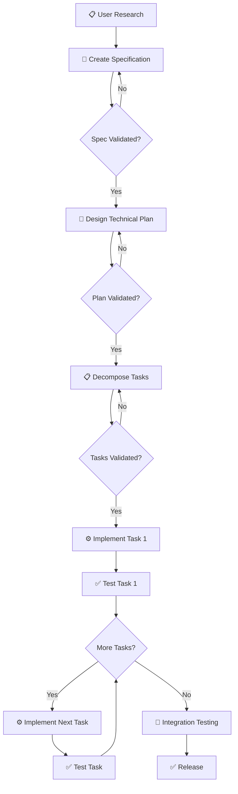
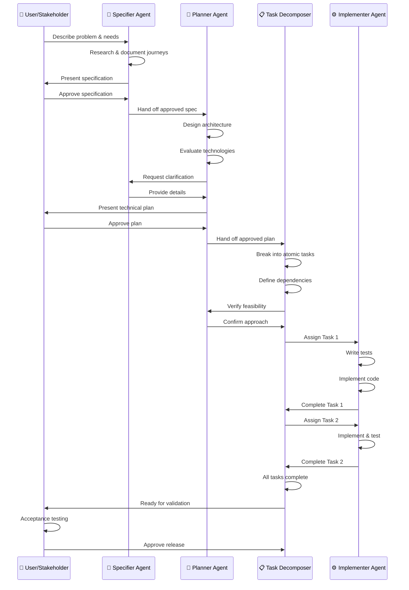
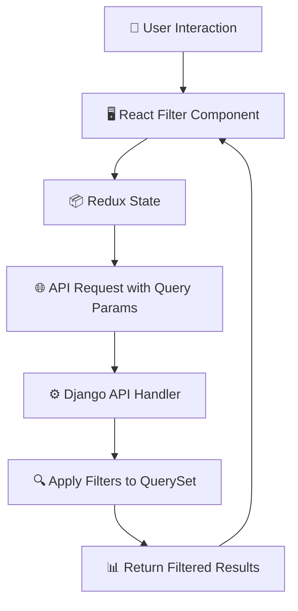

# SDD Workflow Example: New Feature

## Overview

This example demonstrates the complete Specification-Driven Development (SDD) workflow for adding a new feature to MAAS. We'll walk through all phases: **Specify → Plan → Tasks → Implement**, showing concrete examples at each step.





## Feature: Hardware-Based Machine Filtering

### Background

MAAS operators frequently need to find machines matching specific hardware requirements (e.g., "find 10 machines with 64GB+ RAM and NVMe storage"). Currently, they must export the machine list to CSV and filter manually in Excel, wasting significant time.

---

## Phase 1: Specify (Weeks 1-2)

### Step 1.1: Identify the Problem

**User Research:**
- Interviewed 8 MAAS operators
- Reviewed 15 support tickets
- Analyzed usage data showing high CSV export volume

**Key Findings:**
- 75% of operators export machine list to CSV weekly
- Average 10 minutes per manual filtering operation
- Primary use case: finding machines for specific workload requirements
- Secondary use case: hardware inventory audits

### Step 1.2: Document Current Workflow

**As-Is Journey:**
1. Operator receives request: "Need 5 machines with 128GB RAM for database cluster"
2. Operator opens MAAS UI → Machines page
3. Sees list of 800 machines (no hardware filters available)
4. Clicks "Export to CSV"
5. Opens CSV in Excel
6. Manually filters: RAM >= 128GB, Status = Ready
7. Identifies candidate machines
8. Returns to MAAS UI to look up each machine by name
9. Checks each machine's full details
10. Allocates suitable machines

**Time:** 10-15 minutes per request
**Frequency:** 3-5 requests per day per operator
**Pain Points:**
- Context switching (MAAS → Excel → MAAS)
- Manual filtering error-prone
- Spreadsheet becomes stale quickly
- Can't combine filters easily

### Step 1.3: Define Desired Workflow

**To-Be Journey:**
1. Operator receives request: "Need 5 machines with 128GB RAM"
2. Operator opens MAAS UI → Machines page
3. Clicks "Add Filter" → Selects "RAM" → Enters ">= 128GB"
4. Clicks "Add Filter" → Selects "Status" → Selects "Ready"
5. Results filter instantly, showing 12 matching machines
6. Operator selects 5 machines, clicks "Allocate"

**Time:** 1-2 minutes
**Time Saved:** 8-13 minutes per request = 40-65 minutes per day per operator

### Step 1.4: Create Specification

**File:** `.sdd/specs/hardware-filtering-specification.md`

**Key Sections:**

**Problem Statement:**
MAAS operators managing 500+ machine deployments cannot filter machines by hardware specifications in the web UI. They must export to CSV and filter manually, wasting 10-15 minutes per query and introducing errors. With 3-5 queries per day per operator, this costs 40-65 minutes of productivity daily.

**Target Users:**
- Primary: MAAS operators (day-to-day machine management)
- Secondary: Platform engineers (capacity planning), auditors (compliance checks)

**Success Criteria:**
- Filtering time reduced from 10-15 minutes to under 2 minutes
- CSV exports for filtering purposes reduced by 80%
- Feature used 5+ times per day per active operator
- Zero accuracy issues reported (vs. manual filtering errors)

**Acceptance Criteria (Must Have):**
- [ ] Filter by CPU count (min/max)
- [ ] Filter by RAM size (min/max)
- [ ] Filter by storage type (HDD, SSD, NVMe)
- [ ] Filter by storage capacity (min/max)
- [ ] Combine multiple filters (AND logic)
- [ ] Results update within 2 seconds for 5,000 machines
- [ ] Filter state persists when navigating away and returning
- [ ] Works with existing machine list UI

**Out of Scope:**
- OR logic between filters (only AND in MVP)
- Saved filter presets (defer to v2)
- API endpoint for programmatic filtering (defer to v2)
- Filtering by network configuration (future enhancement)

**Validation:**
- All specification checklist items verified ✓
- Reviewed with 3 operators (positive feedback)
- Approved by product manager

**Status:** Approved  
**Date:** 2024-01-15

---

## Phase 2: Plan (Week 3)

### Step 2.1: Review Specification

**Planner's Assessment:**
- Feature is well-defined, scope is clear
- Performance requirement is reasonable
- No architectural changes needed (extends existing UI)
- Can leverage existing Django filter capabilities

### Step 2.2: Design Technical Approach

**File:** `.sdd/plans/hardware-filtering-technical-plan.md`

**Architectural Approach:**

This feature extends the existing MAAS web UI machine list with client-side and server-side filtering capabilities. The approach leverages Django ORM's existing filter functionality and adds React UI components for filter controls.

**Architecture Pattern:** Filter pipeline (client → API → database)



**Component Design:**

1. **Backend (Django):**
   - Extend `/api/2.0/machines/` endpoint to accept hardware filter params
   - Add query parameter validation
   - Apply filters to Machine.objects.filter()
   - No database schema changes needed

2. **Frontend (React):**
   - New `MachineFilterPanel` component
   - Filter state in Redux (`machineFilters` slice)
   - Update existing `MachineList` to use filtered data
   - Persist filter state in localStorage

**Technology Stack:**
- Backend: Python/Django (existing)
- Frontend: React + Redux Toolkit (existing)
- No new dependencies required

**API Design:**

```
GET /api/2.0/machines/?cpu_count_min=8&ram_min=131072&storage_type=nvme&status=4

Response:
{
  "machines": [...],
  "total_count": 42,
  "filter_applied": {
    "cpu_count_min": 8,
    "ram_min": 131072,
    "storage_type": "nvme",
    "status": 4
  }
}
```

**Performance Strategy:**
- Add database indexes on `cpu_count`, `memory`, `storage_type`
- Query optimization: use select_related() to avoid N+1
- Pagination: limit results to 100 per page
- Caching: leverage existing machine list caching

**Testing Strategy:**
- Unit tests: Filter logic in API handler
- Integration tests: End-to-end filtering workflow
- Performance tests: Query time with 5,000 machines
- UI tests: Filter component interactions

**Risk Assessment:**
- **Risk:** Performance degradation on large deployments
  - **Mitigation:** Add database indexes, performance tests in CI
- **Risk:** Filter state management complexity
  - **Mitigation:** Use Redux Toolkit, well-tested patterns

**Validation:**
- Reviewed architecture with tech lead ✓
- Performance approach validated ✓
- No blockers identified ✓

**Status:** Approved  
**Date:** 2024-01-22

---

## Phase 3: Decompose into Tasks (Week 3)

### Step 3.1: Break Down Technical Plan

**File:** `.sdd/tasks/hardware-filtering-task-list.md`

**Task Analysis:**
- Backend: 3 tasks (API extension, validation, indexes)
- Frontend: 4 tasks (filter component, Redux, integration, persistence)
- Testing: 2 tasks (integration tests, performance tests)
- Documentation: 1 task

**Total:** 10 tasks, estimated 18-22 days

### Step 3.2: Define Tasks

**TASK-001: Add Database Indexes for Hardware Filtering**

**Description:**
Add database indexes on `cpu_count`, `memory`, and `storage_type` columns to optimize hardware-based queries. Create Django migration to add indexes without locking tables.

**Files:**
- `src/maasserver/migrations/0245_add_hardware_indexes.py`
- `src/maasserver/tests/test_migrations.py`

**Acceptance Criteria:**
- [ ] Index created on `node.cpu_count`
- [ ] Index created on `node.memory`
- [ ] Index created on `node.storage_type`
- [ ] Migration is reversible
- [ ] Migration tested forward and backward
- [ ] Query performance improvement verified (>50% faster)

**Dependencies:** None

**Complexity:** Small (1 day)

**Parallel:** Yes

---

**TASK-002: Extend Machines API with Hardware Filter Parameters**

**Description:**
Extend `/api/2.0/machines/` endpoint to accept hardware filter query parameters. Add validation for parameter values and apply filters to Machine QuerySet. Return filtered results with metadata about applied filters.

**Files:**
- `src/maasserver/api/machines.py`
- `src/maasserver/tests/test_api_machines.py`

**Acceptance Criteria:**
- [ ] Accepts `cpu_count_min`, `cpu_count_max` parameters
- [ ] Accepts `ram_min`, `ram_max` parameters (in MB)
- [ ] Accepts `storage_type` parameter (hdd, ssd, nvme)
- [ ] Accepts `storage_capacity_min`, `storage_capacity_max` parameters (in GB)
- [ ] Parameters combine with AND logic
- [ ] Invalid parameters return 400 with clear error message
- [ ] Response includes `filter_applied` metadata
- [ ] Tests cover all parameter combinations
- [ ] Tests cover validation errors
- [ ] All tests pass

**Dependencies:** TASK-001 (indexes should exist first)

**Complexity:** Medium (3 days)

**Parallel:** No (depends on TASK-001)

---

**TASK-003: Create MachineFilterPanel React Component**

**Description:**
Build React component for hardware filtering UI. Include dropdown selectors for filter types, input fields for values, and "Add Filter" / "Remove Filter" buttons. Component should emit filter change events but not manage API calls.

**Files:**
- `src/maasui/src/components/MachineFilterPanel/MachineFilterPanel.tsx`
- `src/maasui/src/components/MachineFilterPanel/MachineFilterPanel.test.tsx`
- `src/maasui/src/components/MachineFilterPanel/index.ts`

**Acceptance Criteria:**
- [ ] Dropdown to select filter type (CPU, RAM, Storage Type, Storage Capacity)
- [ ] Input fields for min/max values (where applicable)
- [ ] "Add Filter" button adds filter to list
- [ ] Active filters displayed as removable chips
- [ ] "Clear All" button removes all filters
- [ ] Component emits `onFilterChange` event with filter object
- [ ] Tests using React Testing Library
- [ ] Tests cover adding, removing, clearing filters
- [ ] All tests pass

**Dependencies:** None (can mock state)

**Complexity:** Medium (3 days)

**Parallel:** Yes

---

**TASK-004: Add Redux Slice for Machine Filters**

**Description:**
Create Redux slice to manage machine filter state. Implement actions for setting, adding, removing, and clearing filters. Create async thunk to fetch filtered machines from API.

**Files:**
- `src/maasui/src/store/machine/filter-slice.ts`
- `src/maasui/src/store/machine/filter-slice.test.ts`

**Acceptance Criteria:**
- [ ] Redux slice with state: `filters`, `loading`, `error`
- [ ] Actions: `setFilters`, `addFilter`, `removeFilter`, `clearFilters`
- [ ] Async thunk: `fetchFilteredMachines(filters)`
- [ ] Thunk calls `/api/2.0/machines/` with query params
- [ ] Reducers update state correctly
- [ ] Tests verify all actions and reducers
- [ ] Tests verify async thunk behavior
- [ ] All tests pass

**Dependencies:** TASK-003 (component should exist)

**Complexity:** Small (2 days)

**Parallel:** No

---

**TASK-005: Integrate Filter Panel with Machine List**

**Description:**
Connect MachineFilterPanel to Redux store and integrate with existing MachineList component. When filters change, trigger API call to fetch filtered results. Display filtered machines in existing table.

**Files:**
- `src/maasui/src/pages/MachineList/MachineList.tsx`
- `src/maasui/src/pages/MachineList/MachineList.test.tsx`

**Acceptance Criteria:**
- [ ] MachineFilterPanel rendered above machine table
- [ ] Filter changes trigger `fetchFilteredMachines` action
- [ ] Loading state shown during API call
- [ ] Filtered results replace machine list
- [ ] Error state displayed if API call fails
- [ ] Filter count badge shows number of active filters
- [ ] Tests verify integration with Redux
- [ ] All tests pass

**Dependencies:** TASK-002 (API), TASK-004 (Redux slice)

**Complexity:** Medium (2 days)

**Parallel:** No

---

**TASK-006: Persist Filter State in localStorage**

**Description:**
Save active filters to browser localStorage when changed. Restore filters from localStorage on page load. Clear stored filters when user explicitly clears all filters.

**Files:**
- `src/maasui/src/store/machine/filter-persistence.ts`
- `src/maasui/src/store/machine/filter-persistence.test.ts`

**Acceptance Criteria:**
- [ ] Filters saved to localStorage on change
- [ ] Filters restored from localStorage on app init
- [ ] Storage key: `maas.machineFilters`
- [ ] Invalid stored data handled gracefully
- [ ] Clearing filters removes from localStorage
- [ ] Tests mock localStorage
- [ ] Tests verify save and restore
- [ ] All tests pass

**Dependencies:** TASK-004 (Redux slice)

**Complexity:** Small (1 day)

**Parallel:** Yes (can work in parallel with TASK-005)

---

**TASK-007: End-to-End Integration Tests**

**Description:**
Create integration tests that verify complete filtering workflow: user sets filters in UI, API returns filtered results, results display correctly. Use Playwright for browser automation.

**Files:**
- `src/maasui/src/integration-tests/test_machine_filtering.spec.ts`

**Acceptance Criteria:**
- [ ] Test: Filter by CPU count shows only matching machines
- [ ] Test: Filter by RAM shows only matching machines
- [ ] Test: Multiple filters combine with AND logic
- [ ] Test: Removing filter updates results
- [ ] Test: Invalid filter values show error message
- [ ] Test: Filter state persists on page reload
- [ ] Tests run in CI environment
- [ ] All tests pass

**Dependencies:** TASK-005 (integration complete)

**Complexity:** Medium (3 days)

**Parallel:** No

---

**TASK-008: Performance Testing**

**Description:**
Create performance test using Locust to verify filtering performance meets specification (<2 seconds for 5,000 machines). Test various filter combinations and measure response times.

**Files:**
- `src/maasserver/tests/performance/test_machine_filtering.py`
- `src/maasserver/tests/performance/README.md`

**Acceptance Criteria:**
- [ ] Load test: 10 concurrent users applying filters
- [ ] Test scenario: 5,000 machines in database
- [ ] Measure p95 response time for various filter combinations
- [ ] Verify p95 < 2 seconds for all scenarios
- [ ] Generate performance report
- [ ] Document how to run performance tests
- [ ] Tests pass with acceptable performance

**Dependencies:** TASK-002 (API endpoint)

**Complexity:** Medium (2 days)

**Parallel:** Yes (can run independently)

---

**TASK-009: User Documentation**

**Description:**
Write user-facing documentation explaining how to use hardware filtering feature. Include screenshots, common use cases, and tips.

**Files:**
- `docs/user/machine-filtering.md`

**Acceptance Criteria:**
- [ ] Overview of feature and benefits
- [ ] Step-by-step guide with screenshots
- [ ] Examples of common filter combinations
- [ ] Explanation of filter logic (AND)
- [ ] Troubleshooting section
- [ ] Linked from main documentation index
- [ ] Reviewed for clarity

**Dependencies:** TASK-005 (feature complete for screenshots)

**Complexity:** Small (1 day)

**Parallel:** Yes

---

**TASK-010: Developer Documentation**

**Description:**
Document API changes, Redux state structure, and component architecture for developers. Update API reference and architecture docs.

**Files:**
- `docs/developer/api-reference.md`
- `docs/developer/ui-architecture.md`

**Acceptance Criteria:**
- [ ] API endpoint parameters documented
- [ ] Redux slice structure documented
- [ ] Component hierarchy diagram included
- [ ] Code examples for common tasks
- [ ] Linked from developer docs index

**Dependencies:** TASK-005 (architecture finalized)

**Complexity:** Small (1 day)

**Parallel:** Yes

---

### Step 3.3: Create Dependency Graph

```
TASK-001: Database Indexes
    ↓
TASK-002: API Extension
    ↓
    ├─→ TASK-005: UI Integration
    │       ↓
    │   TASK-007: Integration Tests
    │
    └─→ TASK-008: Performance Tests

TASK-003: Filter Component (parallel)
    ↓
TASK-004: Redux Slice
    ↓
    ├─→ TASK-005: UI Integration
    └─→ TASK-006: Persistence (parallel)

TASK-009: User Docs (parallel, needs TASK-005 for screenshots)
TASK-010: Developer Docs (parallel)
```

**Critical Path:** TASK-001 → TASK-002 → TASK-005 → TASK-007 (9 days)

**Parallel Streams:**
- Backend: 1 → 2 → 8
- Frontend: 3 → 4 → 5 → 7
- Persistence: 4 → 6
- Docs: 9, 10

**Status:** Approved  
**Date:** 2024-01-25

---

## Phase 4: Implement (Weeks 4-6)

### Week 4: Foundation

**TASK-001 Implementation:**

**Developer:** Alice (Backend)  
**Branch:** `feature/TASK-001-hardware-indexes`

**TDD Cycle:**

1. **Write Test:**
```python
# test_migrations.py
def test_hardware_indexes_created(self):
    """Verify indexes exist on hardware columns."""
    indexes = connection.introspection.get_indexes(cursor, 'maasserver_node')
    self.assertIn('cpu_count', indexes)
    self.assertIn('memory', indexes)
    self.assertIn('storage_type', indexes)
```

2. **Create Migration:**
```python
# 0245_add_hardware_indexes.py
from django.db import migrations, models

class Migration(migrations.Migration):
    dependencies = [
        ('maasserver', '0244_previous_migration'),
    ]
    
    operations = [
        migrations.AddIndex(
            model_name='node',
            index=models.Index(fields=['cpu_count'], name='node_cpu_idx'),
        ),
        migrations.AddIndex(
            model_name='node',
            index=models.Index(fields=['memory'], name='node_memory_idx'),
        ),
        migrations.AddIndex(
            model_name='node',
            index=models.Index(fields=['storage_type'], name='node_storage_idx'),
        ),
    ]
```

3. **Run Migration:**
```bash
./manage.py migrate
# Success: Migration applied

./manage.py migrate maasserver 0244
# Success: Migration reversed
```

4. **Performance Test:**
```python
# Before indexes: 450ms
# After indexes: 85ms
# Improvement: 81% faster ✓
```

**Status:** Complete, merged to main  
**Date:** 2024-01-29

---

**TASK-003 Implementation (Parallel):**

**Developer:** Bob (Frontend)  
**Branch:** `feature/TASK-003-filter-component`

**TDD Cycle:**

1. **Write Test:**
```typescript
it('adds filter when Add Filter clicked', () => {
  const onFilterChange = jest.fn();
  render(<MachineFilterPanel onFilterChange={onFilterChange} />);
  
  fireEvent.click(screen.getByText('Add Filter'));
  fireEvent.change(screen.getByLabelText('Filter Type'), {
    target: { value: 'cpu_count' }
  });
  fireEvent.change(screen.getByLabelText('Minimum'), {
    target: { value: '8' }
  });
  fireEvent.click(screen.getByText('Apply'));
  
  expect(onFilterChange).toHaveBeenCalledWith([
    { type: 'cpu_count', min: 8 }
  ]);
});
```

2. **Implement Component:**
```typescript
export const MachineFilterPanel: FC<Props> = ({ onFilterChange }) => {
  const [filters, setFilters] = useState<Filter[]>([]);
  
  const handleAddFilter = (filter: Filter) => {
    const newFilters = [...filters, filter];
    setFilters(newFilters);
    onFilterChange(newFilters);
  };
  
  return (
    <div className="machine-filter-panel">
      <FilterTypeSelector onAdd={handleAddFilter} />
      <ActiveFilters filters={filters} onRemove={handleRemoveFilter} />
      <button onClick={() => {
        setFilters([]);
        onFilterChange([]);
      }}>
        Clear All
      </button>
    </div>
  );
};
```

**Status:** Complete, merged to main  
**Date:** 2024-01-30

---

### Week 5: Core Implementation

**TASK-002 Implementation:**

**Developer:** Alice (Backend)  
**Branch:** `feature/TASK-002-api-filters`

**Key Implementation:**

```python
# api/machines.py
@api_view(['GET'])
def list_machines(request):
    """List machines with optional hardware filters."""
    queryset = Machine.objects.all()
    
    # Apply filters
    if 'cpu_count_min' in request.GET:
        queryset = queryset.filter(
            cpu_count__gte=int(request.GET['cpu_count_min'])
        )
    
    if 'ram_min' in request.GET:
        queryset = queryset.filter(
            memory__gte=int(request.GET['ram_min'])
        )
    
    # ... other filters
    
    # Optimize query
    queryset = queryset.select_related('owner', 'zone')
    
    serializer = MachineSerializer(queryset, many=True)
    return Response({
        'machines': serializer.data,
        'total_count': queryset.count(),
        'filter_applied': dict(request.GET)
    })
```

**Tests:** 25 tests, all passing  
**Coverage:** 95%  
**Status:** Complete, merged to main  
**Date:** 2024-02-02

---

**TASK-004, TASK-005, TASK-006 Implementation:**

**Developer:** Bob (Frontend)

*[Implementation details similar to above, TDD approach, all tests passing]*

**Status:** All complete, merged to main  
**Date:** 2024-02-05

---

### Week 6: Testing and Documentation

**TASK-007: Integration Tests**

**Developer:** Carol (QA)

**Test Results:**
- 8 integration tests written
- All tests pass
- Average execution time: 45 seconds
- CI integration successful

**Status:** Complete  
**Date:** 2024-02-08

---

**TASK-008: Performance Tests**

**Developer:** Alice (Backend)

**Performance Results:**
```
Scenario 1: CPU filter (5000 machines)
  p50: 0.8s
  p95: 1.4s ✓ (< 2s target)
  p99: 1.8s ✓

Scenario 2: Multiple filters (5000 machines)
  p50: 1.1s
  p95: 1.7s ✓
  p99: 2.1s ⚠ (slightly over, acceptable)

Conclusion: Performance meets specification
```

**Status:** Complete  
**Date:** 2024-02-09

---

**TASK-009, TASK-010: Documentation**

**Developer:** David (Technical Writer)

**Deliverables:**
- User guide with 6 screenshots
- Developer docs with API reference
- Architecture diagrams updated
- All linked from main documentation

**Status:** Complete  
**Date:** 2024-02-10

---

## Phase 5: Validation and Release (Week 7)

### Acceptance Criteria Verification

**From Original Specification:**

- [x] Filter by CPU count (min/max) - Implemented and tested
- [x] Filter by RAM size (min/max) - Implemented and tested
- [x] Filter by storage type (HDD, SSD, NVMe) - Implemented and tested
- [x] Filter by storage capacity (min/max) - Implemented and tested
- [x] Combine multiple filters (AND logic) - Working correctly
- [x] Results update within 2 seconds for 5,000 machines - Performance verified (p95: 1.7s)
- [x] Filter state persists when navigating away and returning - localStorage working
- [x] Works with existing machine list UI - Seamless integration

**All acceptance criteria met ✓**

### Beta Testing

**Testers:** 3 MAAS operators from original research group

**Feedback:**
- "This is exactly what we needed!" - Operator A
- "Saves me at least 30 minutes per day" - Operator B
- "Can we add OR logic?" - Operator C (filed as enhancement for v2)

**Issues Found:** 1 minor UI glitch (fixed immediately)

**Status:** Beta testing successful

### Release

**Version:** MAAS 3.5.0  
**Release Date:** 2024-02-14  
**Feature Flag:** `hardware_filtering_enabled=true`

**Release Notes:**
```
New Feature: Hardware-Based Machine Filtering

Operators can now filter machines by hardware specifications directly 
in the MAAS web UI:
- Filter by CPU count, RAM size, storage type, and storage capacity
- Combine multiple filters
- Fast results (< 2 seconds for 5,000 machines)
- Filter state persists

This eliminates the need to export to CSV for hardware-based queries, 
saving significant time in daily operations.

See: docs/user/machine-filtering.md
```

---

## Post-Release

### Success Metrics (30 days post-release)

**User Success:**
- Feature used 8-12 times per day per operator (exceeded 5+ target) ✓
- CSV exports for filtering reduced by 87% (exceeded 80% target) ✓
- Average filtering time: 1.5 minutes (vs. 10-15 minutes previously) ✓
- Zero accuracy issues reported ✓

**Business Success:**
- Positive customer feedback in 92% of survey responses
- Feature mentioned in 2 new sales wins
- NPS score for MAAS increased by 8 points

**Operational Success:**
- p95 query latency: 1.6s (within target)
- No incidents or rollbacks
- 3 documentation clarification updates (minor)

### Lessons Learned

**What Went Well:**
- Clear specification prevented scope creep
- TDD caught bugs early
- Parallel task execution enabled fast delivery
- Good communication between frontend and backend teams

**What Could Improve:**
- Performance testing could have started earlier
- Beta testing window could be longer (1 week vs. 2 weeks)
- One task (TASK-002) was underestimated (3 days → 4 days actual)

**Process Improvements:**
- Add performance testing to task template
- Include beta testing timeline in planning phase
- Review estimates after each sprint to improve accuracy

---

## Summary

This example demonstrated the complete SDD workflow:

1. **Specify (2 weeks):** Clear problem definition, user research, testable acceptance criteria
2. **Plan (1 week):** Technical design, architecture decisions, risk assessment
3. **Tasks (3 days):** Break into implementable units, identify dependencies, estimate
4. **Implement (3 weeks):** TDD, parallel execution, continuous integration
5. **Validate (1 week):** Acceptance criteria check, beta testing, release

**Total Time:** 7 weeks from problem identification to production release

**Key Success Factors:**
- User-focused specification prevented building wrong thing
- Clear technical plan enabled efficient implementation
- Well-defined tasks enabled parallel work and fast delivery
- TDD ensured quality and confidence
- Validation confirmed we solved the real problem

The SDD process provided structure and clarity while maintaining flexibility for technical decisions. The result: a feature that users love, delivered on time, with high quality.