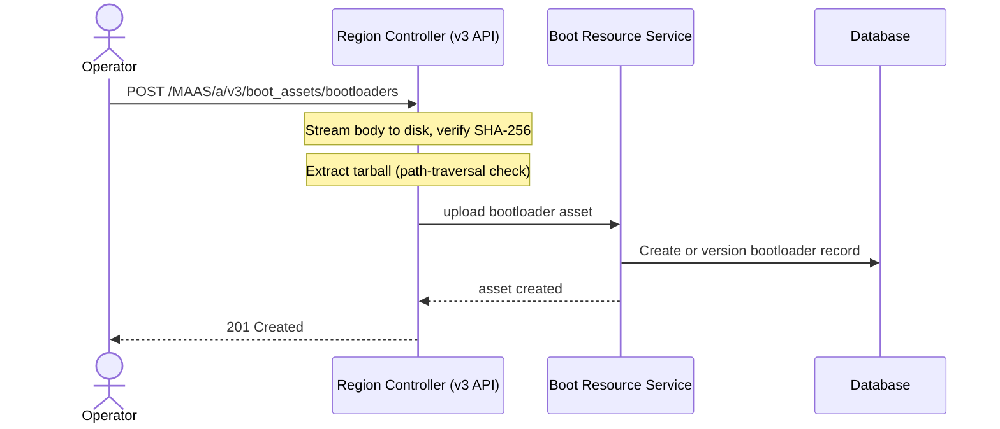
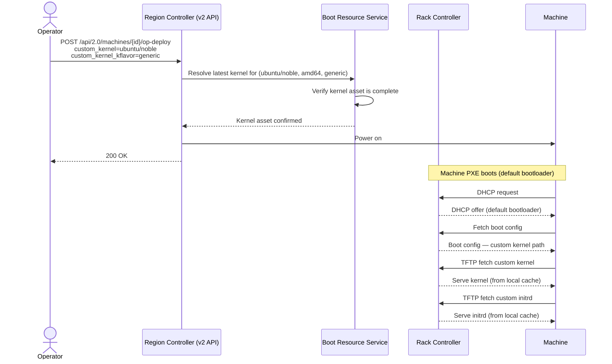
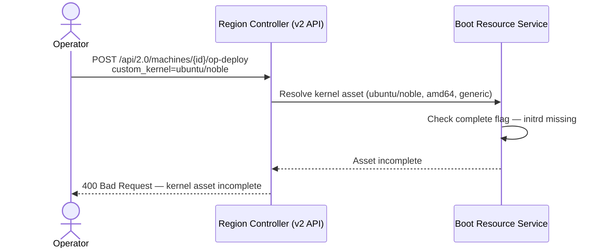

| Index | MAXXXX |  |  |
| :---- | :---- | :---- | :---- |
| Title | Custom Boot Assets |  |  |
| **Type** | **Author(s)** | **Status** | **Created** |
| Implementation | MAAS Team | Braindump | 2026-05-21 |
|  | **Reviewer(s)** | **Status** | **Date** |
|  | — | Pending Review | — |

# Abstract

MAAS does not support operator-supplied bootloaders or kernels as managed assets. This spec introduces upload endpoints for bootloader tarballs and kernel+initrd pairs, backed by the existing `BootResource` storage model, and extends the deploy-time API to accept explicit custom asset selection. When a custom bootloader is assigned to a machine, the Rack Controller's DHCP configuration is updated to deliver that bootloader via a per-host `filename` directive (DHCP option 67). Custom assets are distributed across regions and cached by Rack Controllers using the existing Temporal boot resource sync workflow.

# Rationale

Operators deploying specialised hardware — vendor-specific UEFI shims, patched kernels, custom POWER firmware — must currently supply boot assets out-of-band. There is no MAAS API to upload, version, list, or select alternative bootloaders or kernels. This forces operators to modify DHCP configuration manually and inject files directly into the Rack Controller's TFTP root, bypassing MAAS's sync and lifecycle guarantees.

The existing `BootResource` model already supports `rtype=UPLOADED` resources with versioning, multi-file sets, and per-region sync via Temporal. Custom boot assets fit naturally into this model; the storage, distribution, and serving infrastructure requires no architectural change. Only upload endpoints, DHCP template enrichment, and a deploy-time parameter extension are needed.

# Specification

## User Stories

### [1] As an infrastructure operator, I want to upload a custom bootloader tarball, so that I can assign a vendor-specific bootloader to machines at deploy time.

The operator provides a tarball (`.tar.gz`, `.tar.xz`, or `.tar.bz2`) containing bootloader binaries. MAAS extracts the tarball into an isolated directory, versions the asset, and makes it immediately available for deployment selection. Uploading to the same `name + architecture` identity creates a new version; previous versions are retained. New deployments always resolve to the latest version.

A bootloader asset is identified by `name + architecture`. The `name` field is free-text and typically follows the `{os}/{series}` convention (e.g. `ubuntu/jammy`). The `architecture` field stores `{arch}/{subarch}` (e.g. `amd64/generic`). The `kflavor` field does not apply to bootloaders.

#### Acceptance criteria

- Given a valid tarball upload with a unique `name + architecture`, the asset is created with a new version string and is returned by `GET /MAAS/a/v3/boot_assets/bootloaders`.
- Given a tarball upload for an existing `name + architecture`, a new version is created and the previous version is retained.
- Given an upload where the supplied SHA-256 does not match the received body, the upload is rejected with `HTTP 400`.
- Given a tarball containing a path-traversal entry (e.g. `../../../etc/passwd`), the upload is rejected with `HTTP 400`.
- Given a valid upload, the asset is visible via `GET /MAAS/a/v3/custom_images?type=bootloader` after the upload completes.
- Given a valid upload, the asset is distributed to other Region Controllers via the Temporal sync workflow within 5 minutes.

#### Work Items

- New `POST /MAAS/a/v3/boot_assets/bootloaders` upload endpoint (v3 API).
- Boot resource service: create or version a bootloader asset from an uploaded tarball, with SHA-256 verification and path-traversal-safe extraction.
- Database: partial unique index enforcing `name + architecture` uniqueness for uploaded bootloaders.
- Reverse proxy: increase maximum request body size for the `/MAAS/a/v3/boot_assets` location to accommodate large uploads.

### [2] As an infrastructure operator, I want to upload a custom kernel and initrd as a paired asset, so that machines can boot with a custom kernel during commissioning and deployment.

Both the kernel binary and the initrd file are required for a functional kernel asset. The upload is split into two sequential requests: step 1 uploads the kernel and returns a `resource_id`; step 2 uses that `resource_id` to attach the initrd. Until the initrd is uploaded, the asset is marked `complete: false` and cannot be selected for deployment.

A kernel asset is identified by `name + architecture + kflavor`. The `kflavor` field (e.g. `generic`, `lowlatency`, `hwe`) is mandatory and forms part of the identity key.

#### Acceptance criteria

- Given a completed two-step upload (kernel then initrd), the asset is returned with `complete: true` and is selectable for deployment.
- Given only step 1 completed (no initrd), the asset is returned with `complete: false` and is rejected if selected for deployment.
- Given a SHA-256 mismatch on either file, the upload step is rejected with `HTTP 400` and no partial record is committed.
- Given kernel uploads for the same `name + architecture + kflavor`, each upload creates a new version.
- Given a completed kernel asset, it is usable for both ephemeral (commissioning) and disk deployment environments.

#### Work Items

- New `POST /MAAS/a/v3/boot_assets/kernels` upload endpoint (step 1) and `POST /MAAS/a/v3/boot_assets/kernels/{resource_id}/initrd` endpoint (step 2) in the v3 API.
- Boot resource service: upload logic for each step with SHA-256 verification and `complete` flag tracking.
- Database: partial unique index enforcing `name + architecture + kflavor` uniqueness for uploaded kernels.

### [3] As an infrastructure operator, I want to list and filter custom boot assets by type, name, architecture, and kernel flavour, so that I can locate the right asset for a given machine configuration.

All uploaded boot assets — bootloaders, kernel pairs, and custom OS images — share `rtype=UPLOADED` and are accessible through the existing `/custom_images` endpoint. This endpoint gains filter parameters to narrow results by asset type and property values. Typed endpoints (`/boot_assets/bootloaders`, `/boot_assets/kernels`) return enriched responses with version history, completion state, and primary file metadata.

#### Acceptance criteria

- Given assets of multiple types, `GET /MAAS/a/v3/custom_images?type=bootloader` returns only bootloader assets.
- Given `?type=kernel`, only kernel assets are returned; given `?type=image`, only plain custom OS images are returned; given no `type` parameter, all uploaded assets are returned.
- Given `?name=ubuntu/jammy`, only assets with that exact name are returned, regardless of type.
- Given `?architecture=amd64/generic`, only assets for that architecture are returned.
- Given `?type=kernel&kflavor=lowlatency`, only lowlatency kernel assets are returned.
- Given a `GET /MAAS/a/v3/boot_assets/bootloaders/{id}` request, the response includes `versions`, `latest_version`, `primary_file`, `files`, `created_at`, and `updated_at`.
- Given a `GET /MAAS/a/v3/boot_assets/kernels/{id}` request, the response includes `versions`, `latest_version`, `complete`, `created_at`, and `updated_at`.

#### Work Items

- `type`, `name`, `architecture`, and `kflavor` filter parameters on `GET /MAAS/a/v3/custom_images`.
- `GET /MAAS/a/v3/boot_assets/bootloaders` and `GET /MAAS/a/v3/boot_assets/bootloaders/{id}` endpoints with enriched bootloader response model.
- `GET /MAAS/a/v3/boot_assets/kernels` and `GET /MAAS/a/v3/boot_assets/kernels/{id}` endpoints with enriched kernel response model.
- Response model for `/custom_images` extended with a `type` discriminator field covering all uploaded asset types.

### [4] As a user with deployment permissions, I want to explicitly select a custom bootloader or kernel for a machine deployment, so that the machine uses my preferred boot assets instead of the Simplestreams default.

Asset selection is explicit: no automatic selection logic exists among custom assets. If no custom asset is selected, the system uses the official Ubuntu asset from Simplestreams. The system always resolves to the latest version of the selected asset identity; version pinning is not supported in this iteration.

When a custom bootloader is selected, MAAS updates the Rack Controller's DHCP configuration to deliver that bootloader to the target machine via DHCP option 67, matched by MAC address. The DHCP update must complete before the machine is powered on.

#### Acceptance criteria

- Given `custom_bootloader=ubuntu/jammy` on a deploy request, the machine's Rack Controller DHCP config is updated with a per-host `filename` directive before the machine powers on.
- Given no `custom_bootloader` parameter, the machine receives the default Simplestreams bootloader.
- Given a `custom_bootloader` whose architecture does not match the target machine's architecture, the deploy request is rejected with `HTTP 400`.
- Given a non-existent `custom_bootloader` name, the deploy request is rejected with `HTTP 400`.
- Given `custom_kernel` and `custom_kernel_kflavor`, the machine is deployed with that kernel+initrd pair (latest version).
- Given a user without deployment permission on the target machine, the custom asset selection is rejected with `HTTP 403`.
- Given a machine already deployed with version N, uploading version N+1 does not affect the running machine; new deployments use version N+1.

#### Work Items

- `custom_bootloader`, `custom_kernel`, and `custom_kernel_kflavor` parameters on `POST /api/2.0/machines/{system_id}/op-deploy`.
- Boot resource service: resolve the latest version of a given asset identity for the machine's architecture.
- DHCP host generation: include a per-host boot filename override when a custom bootloader is assigned.
- DHCP template: render the per-host `filename` directive (DHCP option 67) inside the host block.
- Trigger a DHCP config update on the serving Rack Controller before machine power-on.

### [5] As an infrastructure operator, I want custom boot assets to be cached by Rack Controllers, so that machines receive boot files at network speed without every request hitting the Region Controller.

Rack Controllers serve boot assets on demand: on a cache miss, the Rack fetches the file from the Region Controller and caches it locally. Subsequent requests for the same file are served from the local cache. Custom assets must be accessible through this same on-demand fetch path without requiring a new caching mechanism.

#### Acceptance criteria

- Given a custom asset on the Region but not yet cached on the Rack, when a machine requests it via the Rack, the Rack fetches it from the Region and caches it locally.
- Given a cached asset, subsequent machine requests are served from the Rack's local cache without contacting the Region.
- Given a new version of a custom asset uploaded to the Region, a machine that requests it receives the new version on the next cache miss.

#### Work Items

- Ensure custom boot assets are accessible via the existing Rack on-demand fetch path, with no new caching mechanism required.

## Scenarios

### Bootloader upload

An operator uploads a tarball. The Region Controller validates, extracts, and stores it.



Once the asset is stored on the Region, it is served to Rack Controllers on demand: the first time a machine requests a boot file, the Rack fetches it from the Region and caches it locally.

### Deploy with custom bootloader

When an operator deploys a machine with `custom_bootloader` set, MAAS resolves the asset, updates the Rack Controller's DHCP config, and only then powers on the machine. The DHCP update must land before the machine issues a PXE DHCP request.

```mermaid
sequenceDiagram
    actor Operator
    participant V2 as Region Controller (v2 API)
    participant SVC as Boot Resource Service
    participant Temporal as Temporal — DHCP Workflow
    participant Rack as Rack Controller
    participant Machine

    Operator->>V2: POST /api/2.0/machines/{id}/op-deploy<br/>custom_bootloader=ubuntu/jammy

    V2->>SVC: Resolve latest bootloader for (ubuntu/jammy, amd64)
    SVC-->>V2: Bootloader asset + boot filename path

    V2->>Temporal: Trigger DHCP config update
    Temporal->>Rack: Regenerate DHCP config<br/>host { filename "…/shimx64.efi"; }
    Rack-->>Temporal: DHCP updated

    V2->>Machine: Power on
    V2-->>Operator: 200 OK

    Note over Machine,Rack: Machine PXE boots
    Machine->>Rack: DHCP request
    Rack-->>Machine: DHCP offer — filename "…/shimx64.efi"
    Machine->>Rack: TFTP fetch shimx64.efi
    Rack-->>Machine: Serve from local cache
```

### Deploy with custom kernel

When an operator deploys a machine with `custom_kernel` set, MAAS validates the kernel asset is complete, stores the selection in node metadata, and the Rack Controller serves the custom kernel and initrd at PXE boot time.



### Incomplete kernel rejected at deploy time



## Data Model

No new tables are required. Custom assets use the existing four-tier chain:

```
BootResource → BootResourceSet → BootResourceFile → BootResourceFileSync
```

Custom assets reuse the existing `BootResource` storage model without new tables. The four-tier chain `BootResource → BootResourceSet → BootResourceFile → BootResourceFileSync` covers identity, versioning, file storage, and per-region sync tracking respectively.

Asset type is distinguished by existing columns:

| Asset type | Distinguishing fields |
| :--- | :--- |
| Bootloader | `bootloader_type` is set; `kflavor` is null |
| Kernel | `kflavor` is set; `bootloader_type` is null |
| Custom OS image | Both `bootloader_type` and `kflavor` are null |

Two new partial unique indexes enforce identity uniqueness for uploaded assets:

| Index | Columns | Scope | Purpose |
| :--- | :--- | :--- | :--- |
| Bootloader identity | `(name, architecture)` | Uploaded bootloaders only | One lineage per `name + architecture` |
| Kernel identity | `(name, architecture, kflavor)` | Uploaded kernels only | One lineage per `name + architecture + kflavor` |

These indexes are scoped to uploaded resources only and do not affect Simplestreams-synced assets.

The primary EFI binary filename (used as the DHCP option 67 value) is supplied by the operator at upload time and stored as asset metadata alongside the uploaded files.

**Deferred:** Per-machine version tracking (a foreign key from the node to a specific asset version) and garbage collection of old versions are out of scope for this iteration.

## API Changes

### v3 API

All new upload, list, and get endpoints are added to the v3 REST API, mounted under `/MAAS/a/v3/`.

Upload endpoints accept raw `application/octet-stream` bodies. Metadata is passed via request headers to avoid multipart overhead on large binary uploads.

**New endpoints:**

| Method | Path | Permission | Description |
| :----- | :--- | :--------- | :---------- |
| `POST` | `/MAAS/a/v3/boot_assets/bootloaders` | Admin | Upload bootloader tarball |
| `GET` | `/MAAS/a/v3/boot_assets/bootloaders` | View | List bootloaders — paginated, filterable by `name`, `architecture` |
| `GET` | `/MAAS/a/v3/boot_assets/bootloaders/{id}` | View | Get bootloader by ID — enriched response |
| `POST` | `/MAAS/a/v3/boot_assets/kernels` | Admin | Upload kernel binary (step 1 of 2) |
| `POST` | `/MAAS/a/v3/boot_assets/kernels/{resource_id}/initrd` | Admin | Attach initrd to existing kernel resource (step 2 of 2) |
| `GET` | `/MAAS/a/v3/boot_assets/kernels` | View | List kernels — paginated, filterable by `name`, `architecture`, `kflavor` |
| `GET` | `/MAAS/a/v3/boot_assets/kernels/{id}` | View | Get kernel by ID — enriched response |

**Upload request headers (bootloader):**

| Header | Required | Description |
| :----- | :------- | :---------- |
| `x-name` | Yes | Asset name, e.g. `ubuntu/jammy` |
| `x-architecture` | Yes | Target architecture, e.g. `amd64/generic` |
| `x-sha256` | Yes | SHA-256 hex digest of the request body |
| `x-primary-file` | Yes | EFI binary filename inside the tarball, used as DHCP option 67 value |
| `Content-Length` | Yes | Total byte length of the tarball body |

**Upload request headers (kernel, step 1):**

| Header | Required | Description |
| :----- | :------- | :---------- |
| `x-name` | Yes | Asset name, e.g. `ubuntu/noble` |
| `x-architecture` | Yes | Target architecture, e.g. `arm64/generic` |
| `x-kflavor` | Yes | Kernel flavour, e.g. `generic`, `lowlatency` |
| `x-sha256` | Yes | SHA-256 hex digest of the kernel binary |
| `Content-Length` | Yes | Total byte length of the kernel binary |

**Upload response (201 Created)** includes the asset `id`, `name`, `architecture`, assigned `version`, and a list of stored files with their sizes and SHA-256 digests.

**Modified existing endpoints:**

`GET /MAAS/a/v3/custom_images` — four new optional query parameters:

| Parameter | Type | Description |
| :-------- | :--- | :---------- |
| `type` | `bootloader` \| `kernel` \| `image` | Filter by asset type; omit to return all uploaded resources |
| `name` | string | Exact match on asset name |
| `architecture` | string | Exact match on architecture |
| `kflavor` | string | Exact match on kernel flavour; only meaningful with `type=kernel` |

Response items carry a `type` discriminator field (`"bootloader"`, `"kernel"`, or `"image"`) derived server-side from `bootloader_type` and `kflavor` column values.

**Unchanged existing endpoints** — `GET /MAAS/a/v3/custom_images/{id}`, `DELETE /MAAS/a/v3/custom_images/{id}`, and bulk delete cover all `rtype=UPLOADED` resources including custom boot assets. Deletion removes all versions of an asset identity. Per-version deletion is not supported.

### v2 API

The deploy endpoint has no v3 equivalent at the time of writing. Asset selection at deploy time is therefore added to the legacy REST API.

```yaml
POST /api/2.0/machines/{system_id}/op-deploy
summary: Deploy a machine, optionally with a custom boot asset
parameters:
  - name: system_id
    in: path
    required: true
    schema:
      type: string
  - name: custom_bootloader
    in: formData
    required: false
    schema:
      type: string
    description: Name of the custom bootloader asset to use (e.g. ubuntu/jammy). Architecture is matched automatically to the machine.
  - name: custom_kernel
    in: formData
    required: false
    schema:
      type: string
    description: Name of the custom kernel asset to use (e.g. ubuntu/noble). Architecture is matched automatically to the machine.
  - name: custom_kernel_kflavor
    in: formData
    required: false
    schema:
      type: string
      default: generic
    description: Kernel flavour for custom kernel selection. Required when custom_kernel is set.
responses:
  200:
    description: Deployment started
  400:
    description: Named asset not found, or asset architecture does not match the machine
  403:
    description: Insufficient permission to deploy the target machine
```

When `custom_bootloader` is provided, the Rack Controller DHCP configuration is updated to deliver the custom bootloader to the machine before power-on. This endpoint is consumed by the MAAS UI; see `## UI/UX Changes`.

### Simplestreams index (future interface)

The existing `com.ubuntu.maas:candidate:1:bootloader-download` Simplestreams index supports only one bootloader per `(arch, bootloader-type)` pair. A companion index at `com.ubuntu.maas:candidate:2:bootloader-download` is proposed to support multiple named bootloaders per architecture. This index format is a deliverable of this feature but its consumption by MAAS Site Manager is out of scope. See `simplestreams-proposal.md` for the full format specification.

**Open issue:** MAAS Site Manager must be updated to surface the `candidate:2` stream in its mirror policy UI. The Site Manager team must receive the finalised index format before implementation.

## UI/UX Changes

The `custom_bootloader`, `custom_kernel`, and `custom_kernel_kflavor` parameters are added to the v2 deploy endpoint, which the MAAS UI uses. The deploy form should surface these parameters so operators can select a custom asset during deployment. The UI should also distinguish incomplete kernel assets (missing initrd) from complete ones to prevent invalid selections.

A separate UI/UX spec is required to define the interaction design in full.

**Open issue:** The UI/UX spec for custom boot asset selection during deploy has not been produced. This must be tracked as a follow-on deliverable.

## Security

**Authentication:** All v3 API endpoints use the existing OAuth2 authentication mechanism. The v2 deploy endpoint uses session-based or API key authentication consistent with the existing deploy endpoint.

**Authorisation:**

| Operation | Required permission |
| :-------- | :------------------ |
| Upload bootloader or kernel | Admin |
| List or get boot assets | Any authenticated user |
| Delete boot assets | Admin |
| Select custom asset at deploy time | Deployment permission on the target machine |

**Tarball extraction safety:** Tarball entries containing path-traversal components or absolute paths are rejected before extraction. Symlinks that resolve outside the extraction directory are also rejected. These checks run before any record is committed to the database.

**No signature verification:** MAAS does not verify cryptographic signatures on uploaded binaries. Secure Boot compliance and binary signing are entirely the operator's responsibility. MAAS is not a signing authority.

**Data sensitivity:** Bootloader binaries and kernel images are not secrets. SHA-256 digests are stored for integrity verification only.

**Attack surface introduced:**

- Upload endpoints accept large arbitrary binary payloads. Path-traversal and symlink attacks are mitigated at extraction time.
- The primary EFI filename supplied at upload time is later rendered into the DHCP configuration. This value must be validated to be a plain filename — no path separators or shell metacharacters — before storage, to prevent DHCP config injection.
- Asset deletion has no in-use protection in this iteration. An admin could delete a bootloader actively used by deployed machines. This risk is accepted for the current scope and mitigated by restricting deletion to admin users.

**Open issue:** Validation rules for the primary EFI filename (allowed characters, maximum length) must be defined and enforced before the upload endpoint ships.

## Testing

**Unit tests:**

- Repository layer: verify the unique index constraints for bootloader and kernel identity, and that uploading to the same identity produces a new version rather than overwriting.
- Service layer: verify SHA-256 enforcement on upload, `complete` flag behaviour when the initrd is absent, asset resolution returning the latest version, and rejection of an incomplete kernel at deploy time.
- API handler layer: verify request validation, response shapes, permission enforcement (`HTTP 403` without upload permission), and filter parameter behaviour on the custom images list endpoint.

**DHCP configuration tests:**

- Render the DHCP host configuration with a custom bootloader assigned and assert the per-host `filename` directive is present.
- Render without a custom bootloader and assert no per-host `filename` directive is emitted.
- Verify the primary EFI filename is sanitised before it reaches the DHCP template.

**Integration tests:**

- Upload a bootloader tarball via the v3 API and verify the asset record, version, and extracted files are stored correctly.
- Deploy a machine with `custom_bootloader` set and verify the DHCP config update is triggered before machine power-on.
- Deploy a machine with an incomplete kernel asset and verify a `400` response is returned.

**End-to-end (manual, requires live environment):**

- Rack Controller cache hit/miss: a machine request is served from the Region on first access and from the Rack cache on subsequent requests. Cannot be automated in CI without a physical rack.
- DHCP option 67 delivery: a PXE-booting machine receives the custom bootloader filename in the DHCP offer. Requires a machine with PXE capability.

Existing tests for the v2 deploy endpoint and the `/custom_images` list response shape must be updated to reflect the new parameters and the `type` discriminator field.

# Further Information

## Design decisions

**Reuse existing boot resource storage rather than new tables.** The existing schema already handles identity, versioning, file association, and per-region sync. New tables would duplicate this infrastructure and require separate handling in the Temporal sync workflow.

**Two-step kernel upload.** Accepting kernel and initrd as sequential requests allows each file to be streamed and verified independently. The `complete` flag on the asset signals readiness for deployment selection.

**Upload endpoints separate from list/get/delete.** Bootloader tarball extraction and kernel pair validation require distinct processing. Listing and deletion reuse the existing `/custom_images` endpoints, which already cover all uploaded resources.

**DHCP update triggered from the region API layer, not the service layer.** The DHCP update depends on components that belong to the region controller layer and must not be called from the shared service layer, which would violate the architectural boundary between layers.

**`/boot_assets/bootloaders` and `/boot_assets/kernels` prefixes for all operations.** Co-locating upload, list, and get under the same path prefix per asset type avoids routing ambiguity.

## Out of scope

- **Version usage tracking** — no FK from machine to `BootResourceSet`; usage-aware GC is deferred.
- **Garbage collection** — old versions accumulate indefinitely; operators can delete assets manually with no in-use protection.
- **Per-version deletion** — deletion removes the entire `BootResource` identity (all versions).
- **Curtin integration** — writing custom kernels and bootloaders to the target disk is Curtin's responsibility; a separate spec will be produced for the Curtin team.
- **MAAS Site Manager** — Site Manager changes to surface the new Simplestreams multi-bootloader index are out of scope; the Site Manager team must be provided with the finalised index format specification independently.
- **UI deploy form** — surfacing `custom_bootloader` and `custom_kernel` in the MAAS UI requires a follow-on UI spec.

## Related

- GitHub issue: [LP:6688](https://bugs.launchpad.net/maas/+bug/6688) — custom boot assets feature tracking
- `simplestreams-proposal.md` — proposed companion Simplestreams index format for multiple bootloaders per architecture
- `data-model.md` — detailed schema spike notes including index definitions and DHCP data flow
- `contracts/api.md` — full endpoint contract including all response models and error codes
- `contracts/services.md` — service layer method signatures and logic descriptions

# Spec History and Changelog

| Author(s) | Status | Date | Comment |
| :---- | :---- | :---- | :---- |
| MAAS Team | Braindump | 2026-05-21 | Initial brain dump — synthesised from spike implementation on branch `6688-custom-boot-assets` |
| MAAS Team | Drafting | 2026-05-21 | Rewritten to conform to updated spec format: mandatory sections, Mermaid diagrams, v2/v3 API subsections, Data Model, Security, and Testing fully elaborated |
